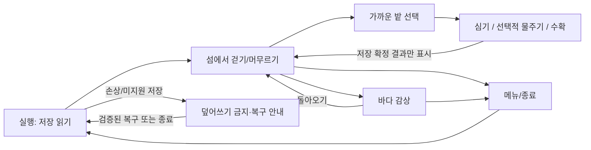

# 마이 리틀 보트 기획서

**현재 상태:** `CURRENT_HUMAN_FACING_GDD`
**갱신일:** 2026-09-20
**읽는 법:** 이 문서는 사람이 게임의 경험과 결정 상태를 이해하기 위한 정본입니다. 실제 코드·Scene·테스트·캡처는 [현재 Godot handoff](../handoffs/CURRENT_GODOT_IMPLEMENTATION.md)가, visual consumer와 provenance는 [visual inventory](../visual/CURRENT_SCREEN_SURFACE_INVENTORY_AND_VISUAL_ASSET_COVERAGE.md)가 소유합니다.

## 현재 결정 — 작은 섬 농장과 바다 감상

`MLB-DIRECTION-20260916 / USER_APPROVED_DIRECTION / ISLAND_RUNTIME_NOT_IMPLEMENTED`

사용자가 확정한 방향은 **작은 섬에서 농장을 돌보고 바다를 바라보며 쉬는 게임**, **일본 청춘 애니메이션풍**이다. 구형 보트 전진감의 추가 개발은 현재 중단한다. 2026-09-20에는 **나중에 배를 타고 섬 밖 풍경을 구경하는 선택적 나들이**를 후속 제품 방향으로 추가했다. 첫 섬 Slice보다 먼저 항해 개발을 재개하는 결정은 아니다. 이름은 `my little boat`로 유지한다. 아래 첫 섬 설계를 같은 날 후속 진행 기준으로 채택했으며, 성장 수치의 최종 밸런스·캐릭터 비율·최종 아트는 미확정이다. 의무 일과·작물 고사·경쟁·전투·유료 압박을 임의로 추가하지 않는다.

기존 보트 구현·승인 자산·세이브 ID·실행 증거는 보존한다. 아래 §0–§8의 항해 흐름·치비 lock·구현 표는 **구형 보트 버전의 보존 기록**이며 새 섬 게임의 명세/완료 근거가 아니다. 구형 브랜치 `codex/title-boat-flow-20260831`의 후속 구현도 자동 통합하지 않는다. local 저장·사진/앨범·감상·바다 소리는 재사용 후보이며, 동반자·낚시·편지는 새 필수 기능으로 확정하지 않았다.

### 재미·표현 검증 기준

`MLB-FUN-20260920 / METHOD_ADOPTED / EXPERIENCE_HYPOTHESES_UNVERIFIED`

방법의 출처는 [Base 재미 검증 생명주기](https://github.com/alsdmlals4-eng/Base/blob/23ecad5a3084f97c4e5d1e39a9a6d70d1eeb37ef/skills/analyzing-and-refining-game-concepts/references/concept-evidence-and-gates.md#fun-verification-lifecycle)와 [경험→효과·비주얼·UI 가이드](https://github.com/alsdmlals4-eng/Base/blob/23ecad5a3084f97c4e5d1e39a9a6d70d1eeb37ef/docs/knowledge/game-development/EXPERIENCE_TO_PRESENTATION_GUIDE.md)다. 프로젝트 의미의 원본은 위 `MLB-DIRECTION-20260916`이며 채택/재조회 경계는 `docs/operations/MY_LITTLE_BOAT_BASE_ADAPTER.json`이 소유한다. Base의 방어/전투 예시와 고정 재미 점수는 채택하지 않는다.

**핵심 경험**은 선택적인 농장 돌보기와 바다 감상이다. 부담 없이 머무는 느낌, 돌본 결과에 대한 작은 애착은 검증할 경험 가설이지 이미 입증된 재미가 아니다. 대상 플레이어는 잠시 쉬고 싶은 사람이라는 기획 가설이며 연령·세션 길이·기기별 선호는 연구 전 미확정이다. 사진/표현/소리 같은 보조 경험은 실제 섬 consumer의 필요가 확인될 때만 재사용한다.

| requirement ID | 경험 가설과 방향 | 대표 구간·반증 질문 | 실제 구현/증거 연결과 현재 상태 |
| --- | --- | --- | --- |
| MLB-ISLAND-REST-01 | `AMPLIFY / HYPOTHESIS`. 농사 행동을 하지 않아도 바다를 보며 편안하게 머물 수 있다. | 작은 농장과 바다를 함께 보는 구간에서 쉬기만 선택한다. 알림·의무·자동 카메라 때문에 일을 해야 한다고 느끼거나 움직임/소리가 피곤하면 반증이다. | 새 섬 Scene·camera·입력은 `PLANNED`. 기존 `scenes/game.tscn`과 `scripts/voyage/game_scene.gd`의 감상/comfort, `scripts/audio/resting_soundscape.gd`는 재사용 검토 대상일 뿐. 섬 MACHINE/RUNTIME/HUMAN은 `NOT_RUN`. |
| MLB-ISLAND-CARE-01 | `AMPLIFY / HYPOTHESIS`. 짧은 돌보기 행동과 눈에 보이는 결과가 내 작은 장소에 대한 애착을 만든다. | 승인 후 대표 돌보기 한 번→결과 확인→바다 휴식 복귀를 완성형 짧은 구간으로 본다. 무엇이 바뀌었는지 모르거나 반복 노동/손실 회피로만 행동하면 반증이다. | crop state owner·성장 규칙·저장·입력/취소는 `PLANNED`. 담당 owner는 이 GDD, 다음 행동은 농장 루프/카메라 대안 조사와 bounded spec 승인. 미정 수치에 의존하는 농사 구현만 보류한다. |
| MLB-ISLAND-PRESENT-01 | `SUPPORT / HYPOTHESIS`. 일본 청춘 애니 분위기 안에서도 대상·선택·확정 결과가 구별되고, 표현이 휴식을 방해하지 않는다. | 같은 구간의 기본/저감 모션·음소거·작은 화면·반복 입력/복귀를 대조한다. 예쁘지만 대상을 못 찾거나 성공처럼 보였는데 결과/저장이 다르면 반증이다. | 시각 owner는 `docs/visual/CURRENT_SCREEN_SURFACE_INVENTORY_AND_VISUAL_ASSET_COVERAGE.md`; 새 섬 asset/state family는 `PLANNED`. 구형 승인 자산은 자동 재승인되지 않는다. 새 아트/사용성/재미는 `NOT_RUN`. |

기능 기획부터 교정까지 같은 ID를 유지한다.

1. **기획.** 승인 경험 원본과 가설·반증·보호 범위를 연결한다. 작은 L1은 기존 Decision/handoff 한 단락, 주요 L2만 필요한 상세 명세를 사용한다.
2. **설계.** 입력·진입/종료 상태·규칙/state owner·선택·공개할 정보·취소/복귀·저장/실패를 정한다. 효과/모션/UI는 접수와 확정 결과를 구분하고 실제 결과를 표시만 한다. 반복/중단/동시 효과·reduced motion·mute에서 필수 정보가 남는지 명시한다. 값은 프로젝트 초기값/계산식·조정 범위·검증 장면으로 정하며 미정은 담당 owner와 의존 작업을 남긴다.
3. **구현.** ID→실제 Scene/Node/Script/데이터/자산→검사를 연결하고, 화면/검사에서 ID와 승인 원본으로 역추적한다. 경로가 존재해도 실제로 호출/표시되지 않으면 연결 완료가 아니다. `PLANNED` 경로를 구현으로 세지 않는다.
4. **검증.** exact commit/build·환경·설정·입력·대표 구간·관찰 질문·중단 기준을 먼저 기록한다. MACHINE은 상태/저장/중단·복귀, RUNTIME은 실제 표시/모션/입력, HUMAN은 행동 관찰·자기보고·반증을 대조한다. 오래 플레이함=재미, 로그 PASS=편안함으로 해석하지 않는다.
5. **교정.** 못 봄/오해함, 규칙·선택 문제, 표현·감각 문제, 반복 피로, 빌드/환경 결함을 구분한다. 같은 승인 범위는 최소 수정·회귀 후 `KEEP / CHANGE / DEFER / RETEST`로 기존 기록에 남긴다. 경험·아트 방향·주요 UX·비용/범위 변경만 재승인한다.

검증할 개발 결정은 “짧은 돌보기와 휴식이 양립하는가, 다음 제작으로 확대할 근거가 있는가”다. 성공은 의도한 결과를 이해하며 쉬기를 자유롭게 선택하는 관찰과 자기보고가 뒷받침되는 경우, 반박은 강제 노동/손실 회피·혼란·감각 피로가 드러나는 경우다. 저장 손상·조작 불능·불편 호소 시 해당 세션을 중단한다. 표본/시간/점수 합격선을 임의로 만들지 않으며 실제 사람 세션 전에 질문·대상·범위를 확정한다.

`DOC / MACHINE / RUNTIME / HUMAN / USER_APPROVAL / RELEASE`는 별개다. 사람 검증은 사용자가 선언할 때만 수행하고, 미실행은 `NOT_RUN`으로 둔다. 승인된 구현은 계속할 수 있지만 자동 검사나 AI 평가를 `FUN_PASS`로 승격하지 않는다. 회색 상자나 Blender 연결 시험은 기술 확인일 뿐 재미 증거가 아니다. 사람 검증은 전체 게임 완성을 기다리지 않고 필요한 아트·소리·UI가 연결된 짧은 대표 Slice로 준비한다. 새로운 감독 skill·분석 서버·중복 재미 보고서는 만들지 않는다.

## 첫 섬 플레이 설계 후보 — 2026-09-20

`MLB-ISLAND-SLICE-01 / P1_IMPLEMENTATION_APPROVED / P1_PARTIAL_BLOCKED_SAVE_PROTECTION / RUNTIME_NOT_IMPLEMENTED`

**최신 구현 상태.** 상세 계획 설명 뒤 사용자가 '좋아 작업 계속 진행해'로 P1 직접 구현을 승인했다. 순수 농사 상태·저장·시간 Session과 신규 검사는 구현했지만 첫 섬 Scene/화면은 없다. 전체 구형 테스트 실행에서 실사용 저장 변경이 발견되어 추가 local 엔진 실행과 병합을 중단했다. [현재 handoff](../handoffs/CURRENT_GODOT_IMPLEMENTATION.md)의 `MLB-P1-SAVE-INCIDENT-20260920`과 실제 코드/테스트가 결과·원인·재개 결정의 원본이다. 아래 과거 승인 설명은 첫 설계 채택 시점의 기록이다.

2026-09-20 PR #109의 설계 결과를 설명한 뒤 사용자가 '좋아 작업진행해'로 후속 진행을 승인했다. C2/I2/T2/S2와 6칸/2작물/바구니를 상세 계획의 기준으로 채택한다. 아래 수치는 시험 초기값이며 최종 밸런스 승인이 아니다. 최종 아트·전체 게임 Blueprint·실제 구현 승인을 이 진행 승인으로 대체하지 않는다. 기존 `MLB-DIRECTION-20260916`과 재미 기준 세 ID를 구체화하며, [P1 상세 구현 계획](../superpowers/plans/2026-09-20-island-p1-state-save.md)의 검토와 자산/Blueprint gate를 연결한다. 과거 제목의 '후보'는 조사 계보를 보존하기 위한 것이다.

### 1. 목적·범위·가장 작은 완성 구간

잠시 쉬고 싶은 플레이어가 작은 섬에서 **돌볼 만큼만 돌보고, 내가 바꾼 풍경 곁에서 바다를 바라보는 경험**을 만든다. 대상층의 실제 선호와 장기 재미는 조사 가설이다. 세계관은 평온한 개인 섬이라는 현재 판타지만 유지하며 새 주인공 신분·서사·NPC 관계를 발명하지 않는다. 전투/난이도/적 AI는 코어와 충돌하므로 `NOT_APPLICABLE`이다.

- 첫 구간의 제작 상한 후보는 섬 1개, 플레이어 1명, 고정 밭 6칸, 작물 2종, 바다 감상 장소 1곳, 수확 결과를 볼 바구니 1개다. 콘텐츠 대량 생산 전에 상태와 표현의 연결을 검증한다.
- 캐릭터 이동·선택적 심기/물주기/수확·바다 감상·종료/복귀가 끊김 없이 이어져야 한다. 아무 행동 없이 쉬거나 성숙한 작물을 남겨도 정상 플레이다.
- 상점/화폐/제작망/퀘스트/일일 보상/접속 연속 기록/의무 수면/작물 고사/체력 소모는 첫 구간에서 제외한다. 수확물은 내 풍경의 결과를 보여줄 뿐 판매·해금 재료가 아니다.
- 동반자·낚시·편지·사진/앨범·자유 건축·여러 섬·계절별 작물은 `DEFER`다. 기존 승인과 코드는 보존하며 새 섬 필수 기능으로 자동 채택하지 않는다.
- 명목상 한 구간은 심기부터 짧은 휴식까지 관찰 가능한 범위다. 의무 체류 시간과 보상 타이머는 없다. 첫 실행은 빈 밭과 눈에 보이는 감상 장소를 제공하고, 강제 튜토리얼·초기 선택 화면은 두지 않는 후보다.

### 2. 조사 질문·근거와 한계

2026-09-20 웹 원문 확인. 결정 질문은 (a) 기다림을 의무로 만들지 않는 성장, (b) 농장 조작과 수평선 감상의 공존, (c) 1인 제작의 화면/자산/저장 비용이다. 공식 제품 설명은 기능 근거, 개발자 글·엔진 문서는 제작 근거, 개별 게시물은 자기보고다. 직접 플레이·전체 영상 분석·통제 실험·시장 판매량 검증은 하지 않았다. 평점과 판매 추정은 채택 근거로 쓰지 않는다. 모든 사례의 성공 규모는 이번 조사에서 `NOT_100K_VERIFIED`다.

| ID / 비교 대상·원문 | 확인한 제품 사실 | 우리 설계의 판단·가져오지 않을 것 |
| --- | --- | --- |
| B01 [Farm Together 2](https://store.steampowered.com/app/2418520/Farm_Together_2/) | 종료 중에도 시간 진행, 농장 확장과 자동 작업을 설명한다. | `ADAPT` 복귀 때 자라 있는 느낌만. 대규모 생산·자동화·수익 최적화는 제외. → 성장 대안 T2 |
| B02 [Garden Life](https://store.steampowered.com/app/1915380/Garden_Life/?l=english) | 식물 돌보기·자유 배치, story/creative mode, 절차적 성장을 설명한다. | `ADAPT` 돌본 결과가 공간에 남는 가치. 절차적 식물 생성·의뢰 경제는 첫 구간에 과함. → 고정 상태 메시/바구니 |
| B03 [Littlewood](https://store.steampowered.com/app/894940/Littlewood/?l=english) | 마을 복원, 농사, 주민 요청과 여러 생활 활동을 설명한다. | `ADAPT` 내 장소 변화. 주민 요청·기술 레벨·생활 시스템 수를 그대로 복사하지 않음. → 두 작물로 결과 가독성 시험 |
| B04 [Cozy Grove](https://store.steampowered.com/app/1458100/Cozy_Grove/?l=english) | 현실 시간과 일일 신규 콘텐츠, 이후 자유 낚시·제작·꾸미기를 설명한다. | `AVOID` 현실 날짜별 콘텐츠 문턱. 휴식 복귀의 리듬만 참고하며 접속 일정은 만들지 않음. → 만료 없는 성숙 상태 |
| B05 [Summer in Mara](https://store.steampowered.com/app/962580/SummerinMara/) | 개인 섬의 농사·제작과 여러 섬 탐험·다수 퀘스트를 결합한다. | `ADAPT` 섬과 생활의 관계. 넓은 항해·심부름망은 기존 방향과 제작 범위에 맞지 않음. → 단일 섬/짧은 동선 |
| B06 [Garden In!](https://www.nintendo.com/nl-nl/Games/Nintendo-Switch-download-software/Garden-In--2436265.html) | 출판사 설명에 화분/흙/씨앗, 성장·교배, 방 꾸미기가 있다. | `ADAPT` 식물 형태가 달라지는 관찰. 교배 조합·도감은 보류. → 두 종/네 상태 가족 |
| B07 [Wylde Flowers](https://wyldeflowersgame.com/) | 농사와 캐릭터 서사, 접근 가능한 조작·낮은 압박을 지향한다. | `ADAPT` 명확한 일상 동작과 접근 경로. 마법·연애·일과는 비채택. 저장 사고 대응은 P02 참고 |
| B08 [Tiny Glade](https://store.steampowered.com/app/2198150/Tiny_Glade/?l=english) | 실패 상태 없이 만들고 바꿔 볼 수 있는 건축을 설명한다. | `ADAPT` 행동 뒤 공간이 읽히는 반응. 절차적 성/자유 건축 엔진은 제외. → 모션 아닌 상태가 결과 소유 |
| B09 [A Short Hike](https://store.steampowered.com/app/1055540/A_Short_Hike/) | 자기 경로·속도로 섬을 탐색하고 주변 활동을 선택한다. | `ADAPT` 이동 자체의 장소감과 선택적 우회. 등반·점프·도달 목표는 제외. → 걷기/바다 감상 |
| B10 [Rusty's Retirement](https://store.steampowered.com/app/2666510/Rustys_Retirement/?l=english) | 화면 하단 농장 자동화와 생산을 느리게 하는 Focus Mode를 설명한다. | `ADAPT` 주의를 덜 요구하는 표시. 상주 창·자동 생산 수익은 비채택. → 성장 알림이 휴식을 중단하지 않음 |
| B11 [Townscaper](https://store.steampowered.com/app/1291340/Townscaper/?l=english) | 배치 입력이 해안 마을 형태로 즉시 바뀌는 건축 장난감이다. | `ADAPT` 입력과 눈에 보이는 결과의 인과. 무목표 건축으로 장르를 다시 바꾸지 않음. → 수확 바구니 |
| B12 [Haven Park](https://havenparkgame.com/) | 작은 평화로운 공간 탐색과 캠핑장 돌보기를 설명한다. | `ADAPT` 작은 공간에서 돌봄과 산책 연결. 방문객 요구 시스템은 보류. → 한 화면의 농장/휴식 관계 |

**긍정·부정·혼합 반응의 표적 표본.** 대표성 없는 소수 게시물을 실패 조건 탐색에만 사용한다. 리뷰를 바탕으로 현재 게임 버그나 다수 이용자의 선호를 단정하지 않는다.

- R01 [Littlewood 2019-12-16 토론](https://steamcommunity.com/app/894940/discussions/0/3963662507768569583/)의 하루 행동량/시간이 짧다는 불만과 조절·진행에 관한 응답을 읽었다. 과거 버전의 불만이며 현재 제품 사실로 확장하지 않는다. B03의 다양한 활동이 긍정적 약속이어도 행동 제한은 우리 게임의 반례다. `AVOID` 행동력/강제 취침.
- R02 [Wylde Flowers 2022-03-14 토론](https://www.reddit.com/r/wyldeflowers/comments/tebakj/)은 검색 결과에 제공된 원글과 댓글까지 확인했다. 느린 속도를 반기는 반응과, 느리면 지루하고 보통은 급해서 상황마다 전환한다는 혼합 자기보고가 있다. 직접 open은 실패했으며 전체 스레드/플레이 시간/현행 패치 동일성은 미확인이다. `TEST` 기다림의 편안함과 지루함을 별도 질문으로 검증. 고정 속도 하나가 모두에게 맞는다는 근거는 아니다.
- R03 [Littlewood 개별 Steam 리뷰가 노출된 페이지](https://store.steampowered.com/app/894940/Littlewood/?curator_clanid=42857742&l=dutch)의 2023-01-26 비추천(표시 총 18.5시간)과 2023-10-24 추천(리뷰 당시 9.5시간)을 읽었다. 전자는 초기 성장/느긋함을 좋아하면서 행동량과 스킬 결과를 비판하고, 후자는 단순한 외형 안의 여러 층을 좋아했다. 두 건의 자기보고이지 비율·원인 증명은 아니다. `TEST` 복잡성 추가 전 두 작물의 차이와 돌봄 결과가 읽히는지 확인.

| ID / 실무·공식 근거 | 확인·적용 | 한계 |
| --- | --- | --- |
| P01 [A Short Hike 개발자 글, 2021-08-05](https://blog.playstation.com/2021/08/05/crafting-a-tiny-open-world-a-look-behind-the-scenes-at-the-creation-of-a-short-hike/) | 제작자가 작은 세계·자유 경로·명상적인 탐색과 1인 제작을 설명. `ADAPT` 단일 섬, 농사를 건너뛰는 경로도 완결 | 그 게임의 제작 기간·아트 방식이 우리 일정/성능 증거는 아님 |
| P02 [Wylde Flowers 공식 변경 기록](https://wyldeflowersgame.com/changes.html) | 1.0.5의 저장 백업/저장 공간 오류 안내/취소 시 재료 반환과 1.7.3 PS5 백업 수정 확인. `ADAPT` 복구/취소를 첫 명세에 포함 | 다른 플랫폼의 문제를 우리 버그라고 단정하지 않음 |
| P03 [Godot SpringArm](https://docs.godotengine.org/en/stable/tutorials/3d/spring_arm.html) | `Camera3D`를 `SpringArm3D` 직접 자식으로 두고 충돌 접근을 설계 | 벽 충돌 회피이지 모든 화면 가림을 해결하지 않음 |
| P04 [Godot 3D 형식](https://docs.godotengine.org/en/stable/tutorials/assets_pipeline/importing_3d_scenes/available_formats.html) | GLB는 메시/텍스처/애니메이션 전달 후보. 직접 blend import는 Blender 의존. `ADAPT` 명시적 GLB 출력 | 아트 shader·리그 전체 일치까지 보장하지 않음 |
| P05 [Godot Time](https://docs.godotengine.org/en/stable/classes/class_time.html) | 시스템 시계는 조정될 수 있고 정밀 경과는 monotonic ticks를 사용. `ADOPT` 성장 시간과 현지 시각 분리 | 종료 중 경과는 신뢰할 서버 시계가 아닌 로컬 추정 |
| P06 [Xbox XAG 117](https://learn.microsoft.com/en-us/gaming/accessibility/xbox-accessibility-guidelines/117) | 불필요한 카메라 흔들림·자동 변화·텍스트 뒤 움직임의 조절. `ADAPT` 고정 수평선, 카메라 bob 없음, 모션 저감 | 가이드 준수나 실제 접근성 PASS를 주장하지 않음 |
| P07 [Godot CharacterBody3D](https://docs.godotengine.org/en/stable/classes/class_characterbody3d.html) | 사용자 조종 몸체·충돌 기반 걷기를 위한 엔진 제공 구조 | 실제 섬 경사·충돌·입력 검사는 구현 이후 |

웹 `stable` 문서는 2026-09-20 조회된 API 설명이며 채택 엔진 변경 권한이 아니다. 구현 직전 로컬 Godot 4.7.2와 대상 API를 대조한다. Blender glTF 공식 manual 직접 열기는 실패하여 그 페이지의 내용은 근거로 쓰지 않았다. 필요할 때 P04와 실제 Blender 왕복 증거를 사용한다.

### 3. 대안 비교와 권장 설계

| 결정 | 대안 1 | 대안 2 | 대안 3 | 이번 권장 후보·이유 |
| --- | --- | --- | --- | --- |
| 공간/카메라 | C1 고정 2.5D 화면·대상 클릭. 제작은 단순하나 자유로운 뒤/옆 보기와 깊이 제한 | C2 작은 3D 지형·걷기·제한 회전·감상 시점. 깊이/모션 재사용 가능, 리그 제작 필요 | C3 자유 3인칭 대형 섬·360도 시점. 탐색은 넓지만 가림/카메라/자산 비용 증가 | **C2 / ADAPT**. 섬의 장소감과 제작 범위를 함께 유지. C1은 기술 문제가 확인될 때 축소 대안, C3은 첫 구간에서 REJECT |
| 성장 시간 | T1 플레이 중에만 경과. 단순하나 앱을 켜 두는 압박 가능 | T2 플레이 중 경과+종료 중 현재 작물만 성장. 복귀 기대와 이탈 자유, 시계 변경 처리 필요 | T3 행동 횟수로 성장. 대기는 없지만 연타/농사 행동이 휴식의 전제처럼 보일 위험 | **T2 / TEST**. 성장 상한은 현재 한 작물의 성숙까지, 자동 재심기/오프라인 수확 없음. T1/T3은 첫 구간에서 비채택 |
| 조작 | I1 탭 이동·자동 접근 후 행동. 쉬운 진입, 경로 실패/의도 밖 행동 위험 | I2 방향 이동+근거리 대상 선택+명시적 행동. 경로 자동화 불필요 | I3 농장 관리 카메라에서 원격 작업. 조작은 간단하나 캐릭터가 공간에서 생활하는 느낌 약화 | **I2 / TEST**. PC 방향키/WASD, 터치 이동 패드와 행동 버튼 동등. 원격 탭은 선택만 하며 자동 행동하지 않음 |
| 저장 통합 | S1 기존 voyage GameState/파일에 농장 필드 추가. 빠르나 save 의미 결합 | S2 섬 전용 파일/owner와 기존 recoverable store의 최소 재사용. 경계 분명, 재검증 필요 | S3 새 범용 저장 프레임워크/DB. 확장 가능하나 첫 구간에는 과함 | **S2 / ADAPT**. 기존 저장/ID 보호. S1/S3 REJECT |

**실현성 판정은 `PARTIAL`이다.** Godot 기본 구성과 Blender→GLB→Godot 기술 왕복은 근거가 있지만 실제 섬 공간·새 캐릭터 리그·성능·입력·성장/저장은 아직 실행하지 않았다. 이 비교가 '최적화 완료'나 `SLICE_BUILD_READY`를 뜻하지 않는다.

### 4. 화면 흐름·공간·입력 계약



| 화면/상태 ID | 진입·보이는 정보 | 입력·취소·복귀 |
| --- | --- | --- |
| IS-ENTRY | 첫 시작 또는 새 프로세스. 로컬 저장 상태를 확인한 뒤 섬 표시 | 정상 저장은 자동 이어하기. 손상 자료를 빈 농장으로 덮지 않음. 초기 외모/기분 선택 요구 없음 |
| IS-WALK | 캐릭터·밭·바다·짧은 메뉴 버튼. 가까운 선택 대상과 가능한 행동만 표시 | PC WASD/방향키, 터치 고정 이동 패드. 방향은 카메라 수평 축 기준. UI 입력은 지면으로 전파하지 않음 |
| IS-TARGET | 근거리 1.6m 이내의 밭/바구니/감상 장소. 대상 외곽선+이름+행동 문구 | 여러 대상은 최근 선택 유지, 없으면 거리→고정 ID 순. PC Tab/화면 대상 전환 버튼으로 바꾸기. 범위 밖 탭은 선택/거리 안내만, 자동 이동/행동 없음 |
| IS-CARE | 빈 밭은 씨앗 2개 선택, 성장 중은 1회 물주기, 성숙은 수확 | PC E/Enter 또는 동일 행동 버튼. 씨앗창 취소는 변경 0. 확정 입력은 현재 대상 ID/세대/리비전 검증 후 저장 명령 한 번만 실행 |
| IS-REST | 감상 장소의 낮은 시점, 수평선·나의 밭 일부·캐릭터가 함께 보임 | 접근 후 명시적 감상 입력. 이동 패드/농사 알림 숨김, 돌아오기/메뉴는 남음. Esc/돌아오기만 종료, 이동 키는 무시하여 우발 종료 방지 |
| IS-MENU | 소리·모션·도움말·종료. 과제/성과 요약 없음 | 열 때 이동/대상 입력 해제. 닫으면 원래 WALK/REST 모드와 의미 있는 focus 복구. 도움말은 심기/물주기 선택/수확/휴식만 설명 |
| IS-STORAGE | 저장 실패 또는 미지원/손상 파일. 결과 성공 연출 없음 | 재시도/검증된 복구 안내/종료. 기존 정상본과 손상 원본 보존. 자동 새 게임/초기화 버튼은 첫 구간에 없음 |

**공간과 카메라 초기값은 조정 가능한 가설이다.** 지형 20×16m 이내의 단일 연결된 보행면, 밭 2×3칸, 밭과 감상 장소 사이 8m 이내로 시작한다. 플레이어 보행 2m/s, 뛰기/점프/수영 없음. 해안은 보행 충돌과 낮은 바위/식생으로 경계를 설명하고 낙하·익사 처벌을 만들지 않는다. 범위 이탈/잘못된 복원 위치는 안전한 시작 위치로 복귀하되 작물은 바뀌지 않는다.

기본 카메라는 원근 3/4 시점(FOV 40°, 하향 35°, 거리 8m 출발), yaw ±35°·pitch 25–45°·거리 6–10m 범위의 명시적 조절 후보다. PC 우클릭 드래그/휠, 터치는 별도 둘러보기 영역 드래그/줌 버튼. 입력별 포인터 ID를 고정하고 UI 위에서 시작한 드래그는 카메라에 전달하지 않는다. 수평선 roll=0, 보행 bob/자동 회전/자동 줌 없음. 카메라 원점은 캐릭터 이동을 따라가되 미세 흔들림을 추가하지 않는다. 처음 구도는 농장과 바다를 동시에 읽는 것부터 조정한다.

감상 시점은 같은 섬 좌표의 고정된 안전한 카메라 transform을 사용한다. 기본 전환 0.6초/저감 0.3초/정지 설정 즉시 전환은 시험 초기값이다. 전환 중 재입력·메뉴·백그라운드에서는 tween을 종료하고 최종 의미 상태를 한 번 적용한다. 돌아오면 진입 전 플레이어 위치/기본 카메라 설정을 복원한다. 저장 후 새 실행은 보행 모드로 시작해 숨은 이동 잠금을 남기지 않는다.

지형과 밭/돌산은 world 좌표에 고정한다. **맵 전체를 카메라 반대로 이동시키지 않는다.** 캐릭터가 실제로 걷고 카메라가 따라가므로 원근·가림 변화가 이동을 만든다. 바다는 독립 메시/material의 잔잔한 움직임, 하늘/원경은 독립 배경, 구름/식생은 각각 제한된 모션으로 다룬다. 바다·하늘·돌산을 한 장에 굽거나 구형 보트 합성 그림을 새 섬 지형으로 쓰지 않는다.

기존 540×960 세로 기준과 `canvas_items/expand`는 유지한다. 720×1280·1080×1920에서 UI 겹침과 crop 대상 가림을 확인하고, 가로/태블릿의 제품 지원 여부는 추후 별도 결정한다. 모바일은 입력 설계 대상이며 실기기 출시/성능 검증 완료를 뜻하지 않는다.

### 5. 농사·결과·시간 명세

밭 슬롯 `plot_01..plot_06`의 선택과 작물 종류/성숙 모습이 작은 표현 선택이다. 수확 효율 경쟁을 만들지 않는다. 씨앗은 무료·무제한이고 도구 구매/내구도/물 보충은 없다. 작물 후보는 `radish`(잎과 뿌리)·`tomato`(지지대와 열매)다. 실제 캐릭터·식물 디자인 lock과는 별개다.

| 데이터 키 | radish 초기 후보 | tomato 초기 후보 | 의미·조정/검증 |
| --- | --- | --- | --- |
| `growth_seconds` | 180 | 480 | 시험 범위 120–600초. 체류 의무가 아니라 비교용 한 주기. 최종 밸런스 미승인 |
| `care_credit_ratio` | 0.20 | 0.20 | 1세대 1회만 전체 성장량의 20%를 추가, 성숙을 넘지 않음. 0–0.25 시험; 보상 연타 금지 |
| `young_threshold` | 0.25 | 0.25 | 진행률 0–0.25 seedling, 0.25–1 young, 1 mature. 수치가 아닌 형태/실루엣으로도 상태 표시 |
| `mature_expiry` | 없음 | 없음 | 수확하지 않아도 손실/경고 없음 |
| `harvest_result` | 바구니에 무 표시 | 바구니에 토마토 표시 | 최근 수확 종류 하나만 표시. 돈/점수/판매/자동 생산 아님. 기존 작물에 맞는 결과만 표시 |

| 권위 상태 | 허용 명령 | 확정 결과 | 잘못된 입력/재입력 |
| --- | --- | --- | --- |
| EMPTY | `plant(crop_id)` | 세대+1, elapsed=0, cared=false, SEEDLING | 모르는 종류/먼 대상/이전 revision은 거부; 비용 없음 |
| SEEDLING / YOUNG | `care` 또는 대기 | care는 1회 credit 추가·cared=true; 시간은 성장량만 증가 | 이미 cared면 중복 변화 없음. 성숙한 순간의 care는 거부하고 UI 갱신 |
| MATURE | `harvest` 또는 그대로 두기 | EMPTY로 전환하고 last_harvest_crop 갱신. 두 변경은 같은 저장 거래 | 같은 세대/revision의 두 번째 수확은 거부; 연출이 다시 저장하지 않음 |

성장 중 뽑기/종 변경은 첫 구간에 넣지 않는다. 잘못 심었다고 손해는 없으며 성숙→수확 후 다른 씨앗을 고를 수 있다. 즉시 취소 가능한 씨앗 선택창을 제공한다. 수확 후 자동 재심기와 강제 다음 행동 안내는 없다.

**시간 처리 후보 T2.** 권위 값은 작물별 `elapsed_seconds`, 저장된 `saved_at_utc`, 실행 중 injected monotonic clock이다. 성장량은 0..growth_seconds로 제한하고 visual phase는 그 값에서 계산한다. 온라인/오프라인 두 clock을 같은 구간에 더하지 않는다.

1. 새 프로세스에서 저장을 읽으면 `max(0, now_utc - saved_at_utc)`를 현재 각 작물의 남은 성장량까지만 한 번 적용한다. 주기는 하나이며 수확/재심기는 자동 실행하지 않는다. 시간이 뒤로 갔으면 성장 손실·벌 없이 0으로 처리한다.
2. 활성 실행 동안은 monotonic ticks의 차이만 적용한다. 현지 시각 변화는 dawn/bright/sunset/night 표현에만 쓰며 성장률·보상을 바꾸지 않는다.
3. focus-out/suspend 때 그 시점까지 reconcile하고 가능한 저장을 시도한 뒤 성장 polling·입력·VFX를 멈춘다. resume은 그 pause anchor와 현재 UTC 차이만 한 번 적용하고 monotonic 기준을 새로 잡는다. 중복 pause/resume 통지는 같은 lifecycle 상태에서 무시한다. 메뉴가 열린 활성 실행 중 성장 자체는 계속되지만 완료 알림은 없고 닫을 때 state를 재표시한다.
4. 큰 미래 시계 점프도 현재 작물의 성숙까지만 허용한다. 로컬 시계 조작으로 빠르게 자라게 할 수 있는 것은 단독·무경제 Slice의 알려진 한계로 수용한다. anti-cheat 서버/시계 보정 계층은 만들지 않는다. 시간대/DST는 UTC 성장 계산과 분리한다.
5. 물주기 직전 시간 reconcile→가용성 재검사→credit 1회→저장→결과 표시 순서다. 모션 길이·프레임 수·배속 설정은 성장 계산의 입력이 아니다.

명령은 사용자 확정 입력 때 한 번 처리하고 성공한 뒤 짧은 모션을 재생한다. 모션 도중 이동/취소는 **표현만** 종료하며 확정된 저장을 되돌리지 않는다. 성공 전 거절/저장 실패는 상태를 바꾸지 않고 작은 실패 안내만 한다. 모션 종료 callback으로 수확·물주기·비용을 처리하지 않는다.

### 6. 저장·복구·모듈 경계와 재사용

새 섬 저장 후보는 `user://island_farm_v1.cfg`다. 기존 voyage/identity/comfort/photo 파일과 save ID를 변경하지 않는다. `GameState.begin_voyage/tick_voyage`를 농사 시간으로 사용하지 않는다. 농장 상태·UI·표현·파일 I/O를 한 스크립트에 넣지 않는다.

| owner / P1 코드·검사는 구현, Scene/표시는 PLANNED | 책임·인터페이스 | 비책임 |
| --- | --- | --- |
| `data/island/crops.json` | schema=1, 위 두 crop ID/성장/credit/phase/visual ID 정의 | 플레이어 진행 저장, 임의 경제 |
| `scripts/island/farm_state.gd` | `preview_command(state, plot_id, action, crop_id, expected_generation, expected_revision) -> Dictionary`와 `advance_elapsed(state, seconds)`로 후보 snapshot 계산; 순수 데이터 검증. 정확한 타입/실패값은 P1 상세 계획이 소유 | Scene/소리/파일 접근 |
| `scripts/island/island_session.gd` | clock/lifecycle/현재 snapshot 소유. `request_action(...) -> result`가 검증→저장→확정 이벤트 수행. `state_changed(snapshot)`로 UI 동기화 | 모션 callback에서 규칙 재계산 |
| `scripts/island/island_save_store.gd` | `load_state() -> result`, `commit(snapshot) -> result`, 명시적 복구. 기존 recoverable store를 island schema validator와 조합 | 다른 세이브 자동 마이그레이션 |
| `scenes/island/island_slice.tscn`, `scripts/island/island_scene.gd` | 지형·밭·캐릭터·감상장소·UI 배선. 상태를 표시하고 의도를 전달 | 작물 성장/파일 권위 |
| `scripts/island/island_player.gd`, `scripts/island/island_camera.gd` | CharacterBody3D 걷기/근거리 선택, camera pivot→SpringArm3D→Camera3D와 REST 전환 | 작물 저장, 조작 없는 자동 orbit |
| `scenes/island/crop_plot.tscn`, `scripts/island/crop_plot_view.gd` | 고정 plot ID와 phase/cared/선택 표시, 모델 상태 교체 | elapsed 누적, 수확 지급 |
| `tests/test_island_farm_state.gd`, `tests/test_island_save_contract.gd`, `tests/test_island_scene_contract.gd` | injected clock/격리 저장/실제 Scene 연결의 자동 검사 | Human 재미 판정 |

신규 `IslandSession`은 Slice root가 소유하는 Node로 시작해 새 autoload를 추가하지 않는다. 테스트에서는 별도 root/경로를 주입한다. 기존 게임 autoload `GameState`·`RestingSoundscape`와 설치 플러그인의 autoload는 보존하되 island는 voyage session을 시작하지 않는다. `RestingSoundscape`의 섬용 제어는 명시적 음량 인터페이스만 연결한다.

저장 snapshot은 `schema_version=1`, `revision`(확정 명령마다 증가), `saved_at_utc`, `plots`(고정 6 ID, crop_id/세대/elapsed/cared), `last_harvest_crop`, 안전한 player XZ/yaw를 갖는다. phase는 파생값이며 중복 저장하지 않는다. 숫자는 finite·범위·타입, ID는 허용 목록을 검사한다. 위치의 타입/비유한 값 같은 형식 손상과, 정상 숫자지만 현재 지형에서 보행할 수 없는 위치를 구분한다. 후자는 농장 전체를 `CORRUPT`로 처리하지 않고 로드 후 위치만 안전한 시작점으로 대체하며 유효한 작물·수확 상태를 보존한다. 보행 판정은 Scene 책임이며 순수 저장 validator에 지형 의존성을 넣지 않는다. 미래 schema는 복구로 구버전 덮어쓰기하지 않고 `UNSUPPORTED_VERSION`으로 보존한다.

거래는 유효한 현재 state→복사본 계산→검증된 파일 commit→in-memory state 교체→표현 이벤트 순이다. `NOT_COMMITTED/RECOVERY_REQUIRED`면 성공 연출과 새 행동은 금지한다. 이동/바다 감상은 가능하고 성장 화면은 마지막 안전 snapshot에 머문다. 재시도는 기존 상태를 다시 읽고 시간을 reconcile한 뒤 사용자가 원한 행동을 다시 확인한다. 검증된 복구도 사용자 동작으로만 하고 손상/unknown 자료는 보존한다. 시작 read는 디스크를 수정하지 않는다. 정상 성장은 30초 후보 간격 및 pause/정상 종료/명령 시 저장하되 hard kill 직전의 위치 복원은 최근 성공 저장까지임을 명시한다. 시간 경과는 마지막 저장 anchor에서 복원한다.

| 실제 읽은 재사용 후보 | 확인한 사용처/차이 | 판단과 다음 검사 |
| --- | --- | --- |
| main `scripts/core/comfort_preferences.gd` | standard/gentle/still 로컬 설정. 현재 GameState→보트 bob 진폭이 consumer | `ADAPT` 값/세이브 ID 유지. 섬 camera bob은 새로 넣지 않고 식생/물/전환 진폭에 매핑. 현재 save는 단순 ConfigFile이므로 복구 안전을 보장하지 않음 |
| main `scripts/audio/resting_soundscape.gd` | autoload OceanBed, display에서 생성·재생·종료 해제. main에는 사용자 음량 연결 없음 | `ADAPT` 파도 원본과 수명. 보트 creak 의미는 섬에 들여오지 않음. 실제 청취는 미검증 |
| continuation `scripts/audio/resting_soundscape.gd`, `scripts/core/comfort_preferences.gd` | `1967483` 이후 음량 smooth gain, GameState signal·설정 저장에 의존 | `ADAPT_CANDIDATE` 필요한 음량 기능만 추출, full GameState 병합 금지. mute/재생위치/복귀 검사 포함 |
| continuation `scripts/core/recoverable_config_store.gd` | read_validated/write_validated/recover_primary, pending/last_good/receipt·해시·검증 callback 존재. main에는 파일 없음 | `ADAPT_CANDIDATE` 새 framework보다 우선. 복구/권한/손상/미지원 schema/중단 write를 섬 전용 경로에서 재검증 후 사용. 코드 존재≠새 소비자 검증 |
| main `scripts/voyage/real_time_atmosphere_resolver.gd` | hour→4개 시간대 ID. GameScene와 Album이 소비 | `ADAPT` ID/순수 시간 함수만. 구형 배경 이미지·성장률은 연결하지 않음 |
| main `scripts/core/photo_memory_persistence.gd`, `scripts/ui/album_view.gd` | voyage PNG/metadata, GameState 사진/항해/동반자 시간과 강결합 | `DEFER` 첫 Slice에 없음. 섬 사진을 옛 항해 파일에 섞지 않음 |
| main `scripts/voyage/look_around_camera_controller.gd` | drag/pitch/yaw 및 각도별 보트 합성 이미지 라우팅 | `REFERENCE_ONLY` 입력 아이디어만. 3D 섬에는 이미지 각도 교체 불필요 |
| main `scripts/voyage/game_scene.gd::_process` | foreground는 함께한 시간/명소에만 적용, fishing/tick_voyage/bob은 별도 | `REJECT_AS_IS` 섬 lifecycle에 그대로 복사하지 않음. scope 안 pause/resume 계약을 새 Session이 소유 |

continuation의 관측 출처는 `80ce184fa6a5571e7cefcb7ad53cdabef896a1cd`다. 이 SHA는 이번 조사 출처이며 미래 실행에서는 원격/소유자를 다시 읽는다. `tests/test_recoverable_config_store.gd`, `test_simple_owner_recovery.gd`, `test_photo_memory_recovery.gd`는 그 브랜치의 재사용 검사 후보이지 이번 실행 PASS가 아니다. 60개 후속 커밋·PR #19·원래 checkout은 변경하지 않는다.

### 7. 아트·모션·사운드 제작 계약

시각 분야 원본은 [시각 inventory의 섬 제작 후보](../visual/CURRENT_SCREEN_SURFACE_INVENTORY_AND_VISUAL_ASSET_COVERAGE.md#섬-플레이-시각-제작-후보--2026-09-20)다. 기존 치비 lock은 구형 보트용이며 새 캐릭터 비율을 확정하지 않는다. 일본 청춘 애니메이션풍의 맑은 색면·부드러운 명암·생활 동작을 목표로 하되 특정 작품 캐릭터/의상/구도를 복제하지 않는다.

농장 화면과 감상 화면을 먼저 합성 가능한 한 세트로 시험한다. 캐릭터·농장·바다의 재질/광원 기준을 맞춘 뒤 다른 자산군으로 확대한다. Blender source→명시적 GLB→Godot wrapper Scene/material로 연결하며 import 결과 파일에 직접 gameplay script를 붙여 재import에 잃지 않는다. Blender 노드 shader가 그대로 전달된다고 가정하지 않고 색/거칠기/alpha/normal·뼈/clip/root motion을 Godot에서 확인한다. 카메라 회전 때문에 캐릭터를 단일 후면 이미지로 대신하지 않는다.

필수 동작은 idle/walk/plant/care/harvest/rest_enter/rest_idle/rest_exit 후보다. 발 접촉과 도구 pivot, interruption→idle, 무음/저감 모션에서도 상태 전달을 검증한다. 완료 표시에는 한 번의 짧은 소리/형태 변화만 쓰고 반복 성장 popup·화면 흔들림·큰 축하를 넣지 않는다. 정지 설정에서는 장식 모션을 줄이되 플레이어 입력으로 발생한 이동과 상태 식별은 보존한다.

### 8. SWOT·차별화와 보완 행동

| 축 | 현재 근거/위험 | 강화·보완 행동 | 확인할 반례·효과 |
| --- | --- | --- | --- |
| S1 | 바다 휴식과 작은 농장이라는 분명한 방향 | `SO` 감상 구도에 내가 돌본 밭/수확 바구니 일부를 남겨 휴식과 돌봄을 한 장소로 연결 | 별도 농장 화면과 배경 감상이 단절되어 보이면 실패 |
| S2 | 로컬 저장·바다 소리·comfort·Blender 왕복 기반 존재 | `ST` 검증 가능한 부분만 재사용하고 온라인 없이 첫 구간 완결 | 기존 보트 모듈 결합 때문에 섬 상태가 오염되면 축소/분리 |
| W1 | 섬 runtime·리그·최종 아트가 없음 | `WO` 단일 섬/2작물/캐릭터1명으로 재import와 완성형 화면을 먼저 검증 | placeholder만 동작하는 상태를 최종 재미 검증으로 보고하지 않음 |
| W2 | 단순 농사가 무의미한 대기/반복일 수 있음 | `WO` 종류·위치·성숙 모습 유지 선택, 바구니의 명확한 결과. 반복 확장 전 편안함과 지루함을 함께 묻기 | 대기만 하거나 수확 이유를 모르겠다면 수치보다 선택/결과 의미부터 교정 |
| O1 | B01/B08/B10/B11처럼 낮은 압박·관찰/표현을 약속하는 여러 제품 존재 | `SO` '성과 화면 대신 내가 돌본 풍경에서 쉬기'를 차별화 가설로 시험 | 이 원리가 시장 독점/판매 성공을 보장하지 않음. 화면만으로 차이를 읽는지 미검증 |
| T1 | R01/R02의 시간 압박·느린 진행 양쪽 불만 | `WT` daily gate·고사·강제 취침 제거, 현재 한 주기만 오프라인 성장 | 앱 켜두기/물주기 최적화를 강요받는 느낌이면 care credit·성장 방식을 재검토 |
| T2 | 3D 제작·카메라 가림·저장 손상이 작은 팀 비용을 키움 | `ST/WT` 제한 회전/짧은 동선/고정 밭·명시적 GLB·복구 저장, feature 확대 보류 | 실제 표적 기기의 frame time·입력/복원 검증 없이는 최적화 완료 아님 |

**차별화 가설.** '많이 수확할수록 커지는 농장'보다 '조금 돌본 흔적을 풍경으로 남기고 그 곁에서 쉬는 섬'을 우선한다. 기존작에도 돌봄·감상은 있으므로 완전한 독창성을 주장하지 않는다. Micro는 명확한 돌봄 결과, Session은 돌보기/그냥 쉬기의 선택, Meta는 내 배치·식물 모습이 남는 연속성이다. 장기 해금·경제는 이 단계에서 약속하지 않는다. 행동–피드백–결과 렌즈를 사용하되 보상 빈도나 실제 도파민을 측정했다고 하지 않는다.

### 9. 승인 후 구현 순서·검증·완료 기준

아래는 **설계에 종속된 작업 순서**이며 실행 가능한 상세 코드 계획/최종 Blueprint를 대신하지 않는다. 새 기획의 검토, 필요한 실제 자산 후보와 Blueprint 검토 게이트를 먼저 닫는다. 신규 파일은 아직 없으며 제품 구현을 이번 조사 완료로 세지 않는다.

| 패키지 | 독립 결과·입출력 | 영향 경로 / 필수 검사 / 완료 기준 |
| --- | --- | --- |
| P1 상태·시간·저장 | crop data+명령→검증된 snapshot/result, 실제 저장 복원 가능 | 위 farm_state/session/save_store+tests. empty→plant→care→mature→harvest, 금지 명령/중복 revision, 음수/NaN/큰 경과, 시계 역행, 재접속/중복 resume, 손상/미지원 schema/쓰기 실패·복구. 기존 파일 bytes 불변. UI 없이 PASS는 기술 증거만 |
| P2 공간·조작·감상 | P1 snapshot에 실제 캐릭터·대상 입력·카메라 연결 | island_slice/player/camera/plot wrapper. 가장자리/충돌/가림/6칸 접근, 보행 불가 복원 위치만 fallback하고 유효 작물 보존, 다중 입력·UI 클릭 누수, REST/메뉴/전환 중 suspend·복귀. 기본/저감/정지 및 해상도 3종 실행 캡처. 회색 상자는 내부 배치 시험만 |
| P3 아트·모션·소리 통합 | 승인 asset state family→위 consumer에 실제 표시 | visual inventory의 IV01–IV07. GLB 재import 전후 gameplay 경로 보존, 발 접촉·도구/clip, 성장 phase/결과 일치, mute/모션 저감, 바다/하늘 레이어. 실제 화면+짧은 모션 증거 필요 |
| P4 대표 구간 교정·패키지 | 처음부터 휴식·종료/재접속까지 연결된 내부 빌드 | 앞 세 패키지 회귀, 저장 fault injection, 낮은 성능 조건·장시간 idle/lifecycle, 기본 UI·한국어 가독성. 사용자 선언 시만 Human 관찰. 정상 PR/병합 main/기존 월간 기록 갱신 |

**검증 시나리오와 증거 경계.** 세 재미 ID에 같은 build/환경을 연결한다.

- `REST-01`. 새 저장으로 어떤 농사 입력도 하지 않고 걷기/감상/종료/복귀 가능. MACHINE은 금지 의무·상태 불변, RUNTIME은 메뉴 복귀/수평선/모션, HUMAN은 '쉬어도 괜찮았는가, 일을 해야 한다고 느낀 순간은?'이다.
- `CARE-01`. 두 작물 중 선택→1회 care→성숙→수확 또는 그대로 두기. MACHINE은 state/credit/저장/중복, RUNTIME은 실제 형태/바구니/무음 결과, HUMAN은 '무엇을 바꿨고 왜 다음 행동을 골랐는가, 기다림이 어땠는가?'이다.
- `PRESENT-01`. 작은 화면·선택 전환·모션 중 취소·음소거·저감·휴식 복귀. MACHINE은 consumer/state 연결, RUNTIME은 대상 가림/입력/clip/정보 보존, HUMAN은 '대상과 결과를 구분했는가, 움직임이 불편했는가?'이다.
- 즉시 중단 기준은 생산 세이브 변경, 복구 불가능한 저장 오류, 입력 영구 잠금, 해안 밖 탈출, 실제 관찰 중 불편 호소다. 짧은 구간의 결과를 전체 게임 재미·장기 유지율·모든 기기 성능으로 확대하지 않는다.
- 현재 DOC는 검토 대상, 새 섬 MACHINE/RUNTIME/HUMAN/최종 아트/RELEASE는 모두 `NOT_RUN`. 성능 목표는 승인 후 기준 기기·renderer·해상도에서 frame time/메모리/draw call을 측정해 정한다. 이번에는 기기 성능 수치를 발명하지 않는다.

**되돌리기와 다음 결정.** 상세 계획은 아래의 채택 설계를 구현 순서로 구체화하며, 새로운 핵심 규칙이 필요하면 따로 결정한다. 구형 보트 코드·세이브·자산을 삭제하거나 엔진/플러그인을 바꾸지 않는다. C2/I2/T2/S2와 6칸/2작물/바구니의 기획 채택은 기록했으며, [P1 상세 구현 계획](../superpowers/plans/2026-09-20-island-p1-state-save.md)과 필요한 자산/Blueprint 검토가 다음 단계다. 공용 Base 승격은 반복 실증이 없으므로 이번에는 제안하지 않는다.

### 10. 후속 확장 — 배를 타고 바깥 풍경 구경

`MLB-BOAT-OUTING-01 / USER_APPROVED_FUTURE_DIRECTION / DEFERRED_NOT_IMPLEMENTED`

사용자 원문은 '배도 나중에 배타고 바깥으로 구경나갈수 있게 할거야'다. 집이 되는 작은 섬에서 선택적으로 배를 타고 바깥 풍경을 구경하는 기능을 후속 로드맵에 포함한다. 섬 농장·휴식을 버리고 이전 항해 중심 제품으로 돌아가는 뜻으로 해석하지 않는다. 새 기능을 구형 보트 runtime의 완료 이력으로 대신하지 않는다.

**현재 설계에서 보호할 연결점.** 농장 상태/시간은 카메라·선박 이동·Scene 수명과 분리한다. 농장은 하나이며 출항 때 복제하거나 초기화하지 않는다. 나들이 중 농사 부재에 벌·고사·귀환 의무를 추가하지 않는다. 탑승→풍경 감상→귀환, 출항 전 저장 실패, 나들이 중 앱 종료/복귀, 위치 복원은 나들이 설계를 할 때 함께 정의한다. 지금은 항해용 세이브 필드·빈 router·부두 버튼·보상·잠금 해제 조건을 만들지 않는다.

| 후속 구현 대안 | 검토 이유와 현재 판단 |
| --- | --- |
| 하나의 거대한 연속 섬·바다 맵 | 전환 없는 이동이 가능하지만 월드 스트리밍/충돌/성능·조작 범위가 커짐. 첫 섬 P1에 도입하지 않음 |
| 작은 나들이 구역을 별도 Scene으로 구성 | 섬과 바다 구역을 따로 다듬기 쉬움. 출항/귀환 경계와 하나의 농장 세션 유지가 필요. **후속 조사 우선 후보**이지 채택된 구현 방식은 아님 |
| 감상용 사전 연출만 재생 | 제작은 작지만 플레이어가 배를 타고 구경한다는 감각·시점 선택을 제한할 수 있음. 비교 후보로만 유지 |

앞서 조사한 B05는 섬 생활과 바깥 탐험을 결합한 제품 사례지만, 우리 나들이의 조작/항로/경관/도착점이 정해졌다는 근거는 아니다. 첫 섬 P1–P4 뒤 별도의 bounded 나들이 명세를 작성하고 필요한 실무 자료·실행 성능을 조사한다. 자동 항해/직접 조종, 귀환 방식, 볼거리 범위, 자산은 그때 검토한다. 이번 계획은 그 결정을 미리 대신하지 않는다.

## 보존된 구형 보트 기획과 실행 증거

이하 “현재”라는 표현은 해당 과거 receipt의 시점이다. 2026-09-20 실제 main의 복구/검사 상태와 다음 작업은 [최신 handoff](../handoffs/CURRENT_GODOT_IMPLEMENTATION.md)를 우선한다.

## 0. 2026-08-30 현재 runtime receipt

아래 상태는 2026-08-30 보트 실행 build의 기록입니다. 이후의 pre-implementation 표와 `NOT_IMPLEMENTED` 표기는 historical context로만 읽고 이 receipt를 덮어쓰지 않습니다.

| 주제 | 현재 상태 | evidence ceiling |
| --- | --- | --- |
| Direct boat entry | 실행 즉시 사용자 승인 후면 3/4 치비 player·강아지·ivory/deep-teal 보트·바다 구도와 compact `쉬는 메뉴`가 보입니다. 플레이어는 stern 쪽에 기대어 뒷모습으로, 강아지는 옆에서 함께 쉬는 모습으로 읽힙니다. `MLB-LOOK-CHIBI-NORMAL-REAR-001`의 보관 원본에서 만든 foreground matte를 `FinalDioramaCard`의 explicit shader material에 연결해, 보트 bob·water-contact·시간대 backdrop을 분리한 채 stern-side normal 3/4를 보입니다. 저장된 `꽃` 펫 쿠션만 bow-side overlay로 보입니다. `엽서`는 main rest composite에 합성하지 않고 꾸미기 preview 난간 장식과 Album의 항해 포스트카드에서 읽습니다. | rear-normal/material/final-card/direct-entry/decor contracts와 bright·night 540×960 GPU capture `PASS`; Human comfort `NOT_RUN` |
| 현지 시간과 풍경 | 현지 시간은 visual-only 네 분위기를 정하고, foreground에 머문 시간만 low-density 자연 명소 기회를 보냅니다. 새벽 아치·해초 모래톱·흰 절벽·사암 코브·갈대섬·밤 생물발광은 각 시간대에만 조용히 지나가며, 첫 기회는 90–150초, 기회별 표시는 65%, 다음 기회는 표시 여부와 무관하게 120–180초입니다. | 47 contracts와 여섯 540×960 GPU capture `PASS`; Human long-run observation `NOT_RUN` |
| 꾸미기 | `꾸미기`에서 플레이어 외형, 동반자 종류, 보트 장식을 local-only로 고르고, 별도 보트 preview에서 즉시 확인합니다. 기본 first-view backdrop은 바꾸지 않습니다. A/B player, cat/rabbit/otter, `stripe`·`moon` cushion은 승인된 soft-matte 치비 family로 실제 선택 경로에 연결됐습니다. | identity/decor/asset-guard contracts와 alternate family 540×960 GPU capture `PASS`; Human readability `NOT_RUN` |
| 함께한 시간 | foreground 항해의 실제 시간을 local-only로 누적하고 Album에서만 분 단위·관계 문구로 보여 줍니다. | together-time contracts와 540×960 Album capture `PASS`; Human readability `NOT_RUN` |
| 모션 편안함 | `파도: 기본/잔잔/고요`는 보트·카메라·수면 접점의 자동 진폭만 `1.0 / 0.5 / 0.0`으로 바꾸는 local-only 선택입니다. | preference/state/scene contracts와 bright GPU capture `PASS`; Human motion comfort `NOT_RUN` |
| 항해 포스트카드 | `사진`은 UI 없는 실제 렌더 프레임 PNG와 메타데이터를 기기에 저장하고, Album은 최신 세 장을 점수·보상 없이 보여 줍니다. | persistence/state/scene/Album contracts와 bright·Album GPU capture `PASS`; Human readability `NOT_RUN` |
| 둘러보기 | `LookAroundCamera3D`와 드래그 입력, 기본·감상 전환, 꾸미기/Album 격리가 구현되었습니다. 사용자가 승인한 투명 수면 치비 family의 좌·우·뒤·위 원화가 exact canonical asset으로 연결됩니다. non-front에서는 중복 normal card만 숨기고 부유 보트 상태와 수면 접점은 유지합니다. | mode/input contracts와 540×960 GPU capture `PASS`; `MLB-LOOK-CHIBI-TRN-001..004` `USER_APPROVED → CANON_REGISTERED → IMPLEMENTED → RUNTIME_CAPTURE_VERIFIED`; Human motion comfort `NOT_RUN` |

## 0. Human Game Blueprint 읽기 profile

`HUMAN_GAME_BLUEPRINT_GDD_LAYERED_PROFILE`

`NO_SEPARATE_BLUEPRINT_ARTIFACT`

이 profile은 새 Blueprint 문서·보드·부록을 만들지 않고 현재 editing master인 이 GDD 안에서 기존 경험·system card·flow·구현 evidence를 계층적으로 읽게 합니다. `docs/design/PROJECT_AI_PRODUCTION_SPEC.md`는 `SUPERSEDED_AS_CURRENT_GDD` 안내 포인터이며 current editing master로 승격하지 않습니다. 이 profile의 역사적 repository baseline은 `main@50909b33bd1d4a4ebc550b5be2a4f9cfe7ccf6d6`입니다.

### 산출물과 publication 경계

`exports/my-little-boat_MASTER_PRODUCTION_GDD_20260829.pdf` = `TRACKED_LATEST_PUBLICATION_SOURCE_BINDING_UNVERIFIED`. tracked latest publication이지만 generator, source SHA, publication receipt가 없으므로 이 GDD의 source-bound current projection이라고 주장하지 않습니다. `exports/my-little-boat_MASTER_PRODUCTION_GDD_20260828.pdf` = `HISTORICAL_DERIVED_NOT_CURRENT_SOURCE`.

`PDF_REISSUE_DEFERRED`: 이번 profile adoption은 두 PDF binary를 수정하거나 새 PDF를 생성하지 않습니다. source-bound generator와 receipt가 설치된 뒤 별도 publication package에서 재발행합니다.

### Layered reader route

| layer | 먼저 답할 질문 | 현재 section |
| --- | --- | --- |
| `PROJECT_PLAYER_LAYER` | 어떤 휴식 경험이며 무엇을 선택하지 않아도 되는가 | §1–§3 |
| `SYSTEM_LAYER` | 머무르기·분위기·풍경·기억이 어떤 flow와 상태로 이어지는가 | §4–§5 |
| `CONTENT_UX_PRESENTATION_LAYER` | 어떤 화면·시각·입력·audio가 경험을 전달하는가 | §5–§6 |
| `PRODUCTION_EVIDENCE_LAYER` | 무엇이 구현됐고 어떤 test/runtime/Human evidence가 남았는가 | §7–§8 및 current handoff/visual inventory |

```text
3-MINUTE PROJECT / PLAYER READ
-> 10-MINUTE SYSTEM + CONTENT / UX / PRESENTATION READ
-> DETAIL READ
-> IMPLEMENTATION READ
-> VERIFICATION READ
```

### 상태와 evidence legend

`STATE_AND_EVIDENCE_LEGEND`

| 상태 | 허용하는 주장 | 허용하지 않는 상위 주장 |
| --- | --- | --- |
| `CONFIRMED` | current GDD·Decision에 제품 방향이 기록됨 | 구현·runtime 동작 |
| `IMPLEMENTED` / `IMPLEMENTED_AND_TESTED` | exact code/Scene/data consumer가 있고 지정 자동 계약이 존재하거나 통과한 receipt가 있음 | 실제 기기 편안함·Human UX |
| `GPU_CAPTURED` | 지정 renderer와 화면 크기에서 화면이 실제 렌더됨 | touch/audio/5분 calmness |
| `PARTIAL_IMPLEMENTED` | 일부 consumer만 존재하고 남은 product alignment가 있음 | system 전체 완료 |
| `CONFIRMED_NOT_IMPLEMENTED` | 제품 방향은 확정됐지만 runtime consumer가 없음 | 구현 시작·완료 |
| `NOT_RUN` | 해당 device/Human/audio evidence가 아직 없음 | 추정에 의한 PASS |

### Prospective future-package gate

`PLAN -> REQUIRED_IMAGE_AND_MATERIAL_PREPARATION -> BLUEPRINT_REVIEW_PUBLICATION -> USER_FINAL_REVIEW_APPROVAL -> IMPLEMENTATION`

`NO_IMPLEMENTATION_BEFORE_USER_FINAL_APPROVAL`: 이 profile 채택 뒤 새 implementation package는 exact reviewed Blueprint revision에 대한 명시적 `USER_FINAL_REVIEW_APPROVAL` 전 시작하지 않습니다. 계획·task breakdown·acceptance는 준비할 수 있지만 implementation execution은 blocked입니다.

`PROSPECTIVE_ONLY_EXISTING_IMPLEMENTATION_EVIDENCE_PRESERVED`: 이미 merge된 code/data/Scene/test와 기존 GPU/runtime evidence는 역사적 사실로 유지되며 이 gate 때문에 취소·하향되지 않습니다.

`PROSPECTIVE_ONLY_PREEXISTING_EXACT_USER_APPROVED_IMPLEMENTATION_AUTHORITY_PRESERVED`: profile 채택 전에 package ID, exact scope, artifact revision/branch/SHA에 연결된 명시적 사용자 구현 승인이 있었다면 그 package의 기존 authority는 유지합니다. `EXACT_APPROVED_SCOPE_AND_REVISION_ONLY`: grandfathering은 승인 기록과 같은 package·scope·revision만 허용합니다. `SCOPE_EXPANSION | SUCCESSOR_PACKAGE | INFERRED_BLANKET_APPROVAL`에는 기존 authority를 재사용할 수 없습니다. PR #19를 포함한 별도 workstream의 authority는 이 profile로 추정하거나 흡수하지 않습니다.

새 image deliverable의 생성·편집은 최신 프로젝트 AGENTS의 승인 경계와 `IMAGE_MODEL_REQUIRED_FOR_IMAGE_CREATION_OR_EDITING`을 따라야 합니다. exact flow/state/system 관계는 `TEXT_NATIVE_EXACT_DIAGRAMS`와 `STRUCTURED_INFORMATION_ARTIFACTS_REMAIN_TEXT_NATIVE`에 따라 Mermaid/Flow/table로 유지합니다. 이미지 생성 성공은 asset 승인·runtime 연결·Human PASS가 아닙니다.

## 1. 이 게임은 무엇인가

`마이 리틀 보트`는 내 캐릭터와 동반자가 바다 위 작은 보트에서 목적지 없이 천천히 지나가며 함께 쉬는 휴식 우선 게임입니다. 플레이어는 목표를 해내기 위해 보트에 오르는 것이 아니라, 게임을 여는 순간 이미 그곳에 있습니다.

### 플레이어 약속

> “게임을 열자마자 내 작은 보트가 동반자와 함께 잔잔한 바다를 목적지 없이 지나가고, 나는 아무것도 하지 않아도 잠시 쉬어 갈 수 있다.”

정상 화면은 보트 뒤쪽 위의 calm 3/4 diorama입니다. 플레이어는 stern 쪽에 기대어 뒷모습으로, 동반자는 바로 옆에서 함께 보이며, 보트·장식·바다와 수평선이 한 장면에 함께 읽힙니다. `Appreciation Camera`는 같은 세계에서 UI를 줄이고 바다·수평선을 더 오래 바라보는 선택적 감상 모드입니다.

### 이 게임이 남기려는 감정

- 편안함과 안정감
- 내 캐릭터·동반자·보트가 만드는 작은 애착
- 혼자 있지만 외롭지 않은 느낌
- 성과보다 개인적인 기억이 남는 느낌

전투, 실패, 경쟁, 등급, 효율, 숙제, 실시간 소셜 압박은 위 감정과 충돌하므로 넣지 않습니다.

## 2. 첫 30초와 시작 흐름

### 확정된 첫 경험

```text
실행
→ 이미 물 위에 떠 있는 보트와 바다를 봄
→ 캐릭터와 동반자가 함께 있는 모습을 봄
→ 그냥 머무르거나, 원할 때만 작은 행동을 선택함
→ 계속 쉬거나 나만의 기억을 남김
```

시작할 때 `오늘의 마음`, 시간대, 외형, 동반자, 장식 중 무엇도 고르게 하지 않습니다. 기기의 **현지 현실 시간**이 새벽·밝음·해질녘·밤 분위기를 자동으로 정합니다. 수동 분위기 control과 마지막 분위기 저장은 없습니다. 기기 시계는 시각 표현에만 쓰며 보상, 항해 진행, 기억 저장, 호감도에는 영향을 주지 않습니다.

외형·동반자·보트 장식은 바다를 본 뒤에만, 원할 때 `꾸미기`에서 바꿉니다. 모든 꾸미기 선택은 cosmetic이며 능력치, 희귀도, 보상, 최적 조합을 만들지 않습니다.

### 첫인상 수용 기준

- 보트 hull과 물의 접점이 읽힌다.
- 느린 bob, 잔물결 또는 wake, 반사·가림이 보트와 바다를 하나의 공간으로 묶는다.
- 캐릭터·동반자·보트는 보이되 수평선과 넓은 바다를 가리지 않는다.
- 큰 선택 panel이 first view를 덮지 않는다.
- 540 x 960 실제 gameplay 크기에서 위 관계가 읽힌다.

현재 제공된 구형 main-entry 구성은 이 기준을 충족하지 않아 `REJECTED_FOR_MAIN_ENTRY_RUNTIME_USE`입니다. 현재 기본 route는 `game.tscn`의 direct boat entry이며, `main_menu.tscn`은 오래된 링크를 이 화면으로 넘기는 호환 경로만 유지합니다. 이 결정은 보트·바다 source binary를 일괄 폐기한다는 뜻이 아닙니다.

## 3. 플레이는 어떻게 이어지는가

### 핵심 반복

```text
바다 위 보트에 머문다
→ 바다와 동반자를 바라본다
→ 원하면 사진·낚시·감상·작은 상호작용·꾸미기를 한다
→ 작은 반응이나 개인적인 기억을 남긴다
→ 계속 머물거나 자연스럽게 떠난다
```

핵심 행동은 “머무르기”입니다. 선택 행동은 정적 화면의 빈틈을 메우는 과제가 아니라, 지금 하고 싶은 만큼만 사용하는 생활감입니다.

### 한 번의 휴식

명목상 한 항해는 약 5분입니다. 기록이 남은 뒤에도 플레이어는 더 머물 수 있습니다. 시간을 끝까지 채우거나 모든 행동을 해야만 완성되는 세션은 아닙니다.

### 남는 기억

사진, 풍경, 낚시 기억, 보트 장식, 함께한 시간, ambient memory는 개인적인 앨범과 보트의 흔적으로 돌아옵니다. 이들은 power, currency, social qualification, collection completion을 위한 재료가 아닙니다.

### 선택과 결과

| 선택 | 플레이어가 고민하는 것 | 관찰 가능한 결과 | 손해가 아닌 것 |
| --- | --- | --- | --- |
| 그냥 머무르기 | 지금은 아무것도 하지 않고 쉬고 싶은가 | 바다·동반자·보트의 조용한 움직임 | 아무 행동도 하지 않는 것 |
| 사진 | 이 순간을 기록하고 싶은가 | 개인 album의 사진 기억 | 사진을 찍지 않는 것 |
| 낚시 | 잠시 기다리는 행동이 어울리는가 | 기다림 뒤 catch, 입질 없는 조용한 거두기, 또는 언제든 취소 | catch가 없거나 중단하는 것 |
| Appreciation Camera | 화면을 덜 보고 바다를 더 볼 것인가 | 낮은 UI의 수평선 감상 | normal view를 유지하는 것 |
| 꾸미기 | 내 공간을 어떤 모습으로 두고 싶은가 | cosmetic appearance 변화 | 장식을 바꾸지 않는 것 |

### 첫 5·15·30분 truth table

`FIRST_5_MINUTES_NOMINAL_SESSION_HYPOTHESIS`: 첫 5분은 반드시 채워야 하는 목표가 아니라 한 번의 명목상 휴식 세션을 설명하는 hypothesis입니다. 실제 기기에서 이 시간이 calm한지는 actual-device calmness `NOT_RUN`입니다.

`FIRST_15_30_MINUTES_CONDITIONAL_OPTIONAL_EXTENDED_STAY_NOT_FORCED_MILESTONES`: 첫 15분과 30분은 플레이어가 스스로 더 머물 때만 생기는 conditional optional extended stay이며 forced onboarding·retention·reward milestone이 아닙니다.

| 시간 | 경험 contract | evidence |
| --- | --- | --- |
| 첫 5분 | 명목상 한 항해에서 머무르거나 원할 때 낮은 압력 행동을 쓰고 자연스럽게 떠날 수 있음 | implementation/automation 일부 존재; actual-device calmness `NOT_RUN` |
| 첫 15분 | 선택적으로 더 머물며 분위기·풍경·개인 기록을 느슨하게 경험할 수 있음 | optional extended-stay hypothesis; Human `NOT_RUN` |
| 첫 30분 | 선택적으로 계속 머물거나 album/꾸미기를 오갈 수 있음 | optional extended-stay hypothesis; Human `NOT_RUN` |

## 4. 시스템 카드

`REUSABLE_FLOW_AND_SYSTEM_CARDS`

기존 system 설명은 아래 공통 card field를 공유합니다. 새 규칙을 복제하지 않고 각 section과 실제 owner를 연결합니다.

| card field | 이 GDD의 표현 |
| --- | --- |
| player purpose | `플레이어가 보고 하는 일`, `필요한 이유` |
| trigger/input + choice/condition | §3 핵심 반복·선택과 결과, §5 화면 flow |
| state/data change | current handoff의 foreground/session/persistence owner |
| output/feedback + failure/recovery | `피드백`, `피해야 할 압박`; 실패 pressure는 N/A |
| content/UX/presentation consumer | §5 화면, §6 visual direction, soundscape requirement |
| implementation owner | `CURRENT_GODOT_IMPLEMENTATION.md`의 exact Scene/script table |
| acceptance/evidence | §7 상태, Blueprint evidence ceiling, tests/captures/Human boundary |

### Core flow card

| flow ID | player purpose | trigger/input | choice/condition | state/data change | output/feedback | owner/evidence |
| --- | --- | --- | --- | --- | --- | --- |
| `FLOW-REST-001` | 보트 위에 바로 도착해 압박 없이 머무름 | app 실행 또는 normal voyage 복귀 | 머무르기·선택 행동·자연스럽게 떠나기 | foreground time과 선택적 local memory만 변화 | calm diorama, atmosphere, 낮은 밀도 풍경 | `game.tscn`, `game_scene.gd`; automated/GPU evidence, Human `NOT_RUN` |

### System traceability cards

`LAYERED_TRACEABILITY_REQUIRED`

| system ID | player contract | exact implementation owner | content/UX/presentation consumer | acceptance/evidence |
| --- | --- | --- | --- | --- |
| `SYS-REST-001` | 아무 입력 없이 머무르기도 complete play | `scenes/game.tscn`, `scenes/boat_space.tscn`, `scripts/voyage/game_scene.gd` | Direct boat entry, normal/appreciation camera, boat-water presentation | direct-entry contracts + 540 x 960 GPU capture; device calmness `NOT_RUN` |
| `SYS-ATMOS-001` | 현실 시간은 시각 분위기만 바꿈 | `scripts/voyage/real_time_atmosphere_resolver.gd`, `scripts/voyage/game_scene.gd` | dawn/bright/sunset/night sea and light | resolver/game contracts + GPU captures; Human transition judgment `NOT_RUN` |
| `SYS-SCENERY-001` | foreground에서 풍경이 낮은 밀도로 지나감 | `scripts/voyage/drift_scenery_director.gd`, `scenes/distant_scenery.tscn` | buoy/islet/lighthouse, auto-fade notice | director/runtime contracts + islet capture; 5-minute frequency `NOT_RUN` |
| `SYS-MEMORY-001` | 일부 풍경이 보상 압박 없는 local memory로 남음 | `scripts/core/ambient_memory_persistence.gd` | Ambient Discovery, Album | persistence/GameState round-trip contracts; noticeability `NOT_RUN` |
| `SYS-RELATIONSHIP-001` | 함께 머문 시간이 조용한 관계 문구로 남음 | runtime owner 없음 | future Album relationship copy | `CONFIRMED_NOT_IMPLEMENTED` |

### 떠 있는 휴식

**플레이어가 보고 하는 일.** 캐릭터와 동반자가 탄 보트가 잔잔한 바다를 목적지 없이 천천히 지나가는 모습을 보고, 원하면 아무 입력 없이 머뭅니다.

**필요한 이유.** 이 게임의 핵심 재미는 보상 전 대기 시간이 아니라 함께 존재하는 장소를 보는 데 있습니다.

**피드백.** 보트의 느린 전진과 bob, 바다·하늘의 변화, 동반자의 낮은 빈도 idle, 파도 중심 soundscape가 “함께 흘러가고 있다”는 감각을 줍니다.

현지 시간이 바뀌면 하늘·빛·바다의 색과 반사가 천천히 이어집니다. active foreground로 머문 시간이 쌓이면 새벽의 바다 아치, 밝은 낮의 해초 또는 절벽, 해질녘의 사암 코브 또는 갈대섬, 밤의 먼 생물발광처럼 한 장면이 낮은 밀도로 흘러갑니다. 이 장면은 10초 뒤 현재 시간대의 물만 있는 기본 바다로 돌아오며, 버튼·목적지·보상·과제가 아닙니다. 둘 다 해야 할 일이나 보상이 아니라, 같은 장소가 살아 있다는 배경 감각입니다.

**피해야 할 압박.** 방치 벌, timer 실패, idle 보상, 매분 확인 요구, 목적지·항로·도착 보상.

**상태.** 자연 명소 여섯 장은 `USER_APPROVED → CANON_REGISTERED → IMPLEMENTED → MACHINE_VERIFIED → RUNTIME_CAPTURE_VERIFIED`입니다. 실제 기기에서의 휴식감은 `NOT_RUN`입니다.

### 감상 카메라

**플레이어가 보고 하는 일.** 필요할 때 UI를 줄이고 바다와 수평선에 집중합니다.

**필요한 이유.** 캐릭터와 보트를 보는 휴식과 바다만 보는 휴식은 서로 다른 순간에 필요합니다.

**피드백.** 같은 항해 시간과 soundscape 안에서 시야만 조용해집니다.

**피해야 할 압박.** 보상, timer, 동반자 관계, ambient discovery 확률을 바꾸는 별도 게임 모드.

**상태.** earlier runtime slice에 존재합니다. 실제 기기에서의 편안함은 `NOT_RUN`입니다.

### 둘러보기

**플레이어가 보고 하는 일.** 원할 때 보트 주변을 천천히 드래그해 좌우·뒤·위 시점을 바라봅니다. 마음에 드는 곳에서 멈춰도 되고, 기본 3/4 시점이나 감상 카메라로 언제든 돌아갈 수 있습니다.

**필요한 이유.** 같은 보트 안의 사람·동반자·랜턴·물결을 다른 거리와 각도에서 보는 작은 변화가, 목적지 없이도 살아 있는 항해 감각을 더 분명하게 합니다.

**피드백.** 카메라만 바뀌며 항해 시간, 속도, 함께한 시간, 장식, 사진·풍경·낚시 기억, 저장, soundscape는 바뀌지 않습니다. 화면은 PC의 왼쪽 버튼 드래그와 모바일 화면 드래그를 쓰고, 수평선은 기울지 않으며 큰 자동 회전·줌·번쩍임은 없습니다.

**피해야 할 압박.** 특정 시점을 모두 찾아야 하는 수집, 각도별 보상, 생물 추적, 목표표식, 이동 강요, 멀미를 유발하는 관성·강제 카메라.

**상태.** 입력·mode 격리, 승인된 `port`·`starboard`·`aft`·`overhead` canonical asset routing, 기본 Normal의 후면 치비 foreground material, 저장된 `꽃` 펫 쿠션·`엽서`의 치비 decor consumer, 그리고 normal·네 각도·Appreciation의 540×960 GPU capture가 `IMPLEMENTED / RUNTIME_CAPTURE_VERIFIED`입니다. 이 상태는 항해 시간·속도·저장·보상·soundscape를 바꾸지 않습니다. 기본 C+강아지 Normal은 `MLB-LOOK-CHIBI-NORMAL-REAR-001` 보관 원본에서 만든 `MLB-LOOK-CHIBI-NORMAL-REAR-MATTE-001`를 `FinalDioramaCard`에 연결하고 stern-side rig에서 보여 주며, water-only backdrop과 BoatSpace 부유를 유지합니다. 사용자가 승인한 alternate A/B player, cat/rabbit/otter, `stripe`·`moon` cushion 7종은 exact canonical copy와 기존 save ID를 사용해 layered `Sprite3D`와 decor texture consumer에 연결됐습니다. 실제 기기의 motion comfort, touch reachability, 장시간 휴식감은 `NOT_RUN`입니다.

### 꾸미기

**플레이어가 보고 하는 일.** 도착 뒤 원할 때 외형, 동반자 species, 보트 장식을 바꿉니다.

**필요한 이유.** 공간이 “게임의 배경”이 아니라 “내 작은 장소”로 느껴지게 합니다.

**피드백.** 기본 바다 화면을 바꾸지 않는 별도 보트 preview에서 바뀐 외형·동반자·장식이 즉시 보입니다.

**피해야 할 압박.** stats, rarity, gacha, price, daily shop, 모든 slot 채우기, 최적 배치.

**상태.** in-voyage `꾸미기`, local-only preview, 기존 ID를 보존한 alternate 치비 asset family가 `IMPLEMENTED / MACHINE_VERIFIED / RUNTIME_CAPTURE_VERIFIED`입니다. 실제 기기에서의 readability와 touch comfort는 `NOT_RUN`입니다.

### 사진·조용한 낚시·작은 상호작용

**플레이어가 보고 하는 일.** 지금의 풍경을 찍고, 조용히 기다리거나, 보트의 작은 물건·동반자와 가볍게 반응합니다.

**필요한 이유.** 가만히 쉬기와 별개로 손을 조금 쓰고 싶은 플레이어에게 낮은 밀도의 생활감을 줍니다.

**피드백.** 사진은 UI 없는 실제 항해 프레임을 local PNG와 메타데이터로 남기고, Album의 최신 세 장 포스트카드로 돌아옵니다. catch만 물고기 기억으로 남고, 입질 없는 거두기·취소·작은 상호작용은 짧은 문구와 작은 pose만 남기며 저장·보상·함께한 시간을 만들지 않습니다.

**피해야 할 압박.** 반복 탭, 확률 보상 farming, 실패 패널티, 행동 횟수에 따른 동반자 보상.

**상태.** 사진의 local PNG 저장·메타데이터 복원·UI 복구·Album 최근 세 장 표시는 `IMPLEMENTED / RUNTIME_CAPTURE_VERIFIED`입니다. 낚시는 `catch → 저장`, `무수확 → 조용한 거두기`, `기다림 → 취소`를 모두 손해 없이 처리하고, 상호작용은 동반자의 `나란히 쉬기`와 난간의 `파도 소리 듣기`를 포함합니다. focused 계약과 540×960 OpenGL capture가 `IMPLEMENTED / MACHINE_VERIFIED / RUNTIME_CAPTURE_VERIFIED`입니다. 실제 기기에서 사진·앨범·새 문구의 가독성이 편안한지는 `NOT_RUN`입니다.

### 함께 보낸 시간

**플레이어가 보고 하는 일.** 동반자와 active foreground 항해에서 함께 보낸 시간이 앨범에 조용히 쌓이는 것을 봅니다.

**필요한 이유.** 동반자를 행동 보상으로 바꾸지 않고도 함께 머문 시간이 의미 있게 느껴지게 합니다.

**피드백.** 앨범의 시간과 짧은 관계 문구.

**피해야 할 압박.** live level, progress bar, growth popup, species bonus, action multiplier.

**상태.** active foreground delta만 누적하고 `user://together_time_v1.cfg`에 local-only로 저장하는 구현이 `IMPLEMENTED / RUNTIME_CAPTURE_VERIFIED`입니다. 실제 기기에서의 readability와 pressure 판단은 `NOT_RUN`입니다.

### 흘러가는 풍경과 배경 발견 연출

**플레이어가 보고 하는 일.** active foreground로 머무는 동안 새벽의 바다 아치, 밝은 낮의 해초 또는 흰 절벽, 해질녘의 사암 코브 또는 갈대섬, 밤의 먼 생물발광처럼 바다의 자연경관이 천천히 지나가는 것을 봅니다. 일부 낮은 빈도의 장면은 짧은 알림과 함께 개인 memory로 자동 저장됩니다.

**필요한 이유.** 바다가 정지한 배경이 아니라 천천히 흘러가는 장소처럼 느껴지되, 휴식을 끊지 않게 합니다.

**피드백.** 현재 시간대의 자연 명소, 짧고 사라지는 notification, local ambient memory.

**피해야 할 압박.** 발견을 보기 위한 기다림, button 요구, reward claim, task, social message, missed-event penalty, 구조물을 탭해야 하는 상호작용.

**상태.** active foreground 시간만 사용하고, 명목 5분에 약 1-2회가 지나가되 zero도 정상이라는 cadence와 여섯 승인 motif의 runtime consumer는 `IMPLEMENTED / MACHINE_VERIFIED / RUNTIME_CAPTURE_VERIFIED`입니다. actual device에서의 5분 휴식감·noticeability·반복 피로는 `NOT_RUN`입니다.

### Album

**플레이어가 보고 하는 일.** 실제 사진, 기록, catch와 함께한 시간을 돌아봅니다.

**필요한 이유.** 효율표가 아닌 개인적 기억이 시간이 남는 방식입니다.

**피드백.** 내가 실제로 남긴 기록과 조용한 관계 문구.

**피해야 할 압박.** completion checklist, 가짜 illustrative photo, collection score.

**상태.** Album surface는 `PARTIAL_IMPLEMENTED`입니다. 함께한 시간의 Album-only 표현, 실제 사진 포스트카드, 자동 풍경, 물고기와 완료 항해 기록의 local save·restore는 각각 `IMPLEMENTED / RUNTIME_CAPTURE_VERIFIED`입니다. delayed bottle 편지 내용과 그 밖의 전체 memory save는 별도 범위입니다.

## 5. 화면과 정보의 흐름

| 화면 또는 상태 | 플레이어 목표 | 주요 행동 | 다음 연결 | 제품 상태 |
| --- | --- | --- | --- | --- |
| Direct boat entry | “여기는 어떤 장소인가”를 즉시 느낌 | 보기, 머무르기 | normal voyage | `IMPLEMENTED / RUNTIME_CAPTURE_VERIFIED` |
| Normal voyage diorama | 캐릭터·동반자·보트·바다와 시간에 따라 바뀌는 풍경을 함께 보기 | 쉬기, 사진, 낚시, 감상, 꾸미기 | album 또는 계속 머무르기 | direct-entry atmosphere/scenery `RUNTIME_CAPTURE_VERIFIED`; Human calm `NOT_RUN` |
| Appreciation Camera | 수평선과 바다에 집중 | 감상 시작·종료 | 같은 normal voyage | `IMPLEMENTED`; Human comfort `NOT_RUN` |
| 꾸미기 | 공간을 내 취향으로 두기 | 외형·동반자·장식 변경 및 별도 preview 확인 | 같은 normal voyage | `IMPLEMENTED / RUNTIME_CAPTURE_VERIFIED`; Human readability `NOT_RUN` |
| Album | 남은 개인 기록과 함께한 시간 보기 | 최근 포스트카드 세 장, 복원된 물고기·항해 기록 읽기, 바다로 돌아가기 | normal voyage | together-time·postcard·ambient·fish/voyage ledger `IMPLEMENTED / RUNTIME_CAPTURE_VERIFIED`; delayed-letter persistence를 포함한 전체 memory save `PARTIAL_IMPLEMENTED` |

첫 화면은 메뉴가 아니라 direct boat entry입니다. `main_menu.tscn`은 오래된 링크를 넘기는 compatibility route이며, 그 identity/time/mood capture runner는 `HISTORICAL_RETIRED`입니다. 현재 디자인 정본이나 visual approval, current runtime evidence로 사용하지 않습니다.

## 6. 확정된 시각 방향

### 시각 방향 고정

- 전체: `HANDPAINTED_STORYBOOK_3D_DIORAMA`
- 둘러보기 foreground: `MLB-LOOK-STYLE-006`의 soft-matte chibi player + round dog + matte ivory/deep-teal rounded dinghy
- 기본 Normal Diorama foreground: 기본 C+강아지 route는 stern 쪽에 기대어 뒷모습으로 보이는 `MLB-LOOK-CHIBI-NORMAL-REAR-001`의 user-approved source와 그 기술용 foreground matte `MLB-LOOK-CHIBI-NORMAL-REAR-MATTE-001`를 `FinalDioramaCard` shader material로 소비한다. normal rig는 보트 뒤쪽 위에서 바라보며, card `pixel_size=0.0037`은 새 원화의 넓은 하늘 여백 속에서도 보트·player·dog가 모바일에서 읽히도록 한다. material은 녹색 기술 배경만 alpha 처리하고, 시간대별 water-only backdrop·수면 접점·BoatSpace bob을 유지한다. user-approved `꽃` 펫 쿠션만 bow-side overlay로 보인다. `엽서`는 main normal art에 합성하지 않으며, independent 꾸미기 preview 난간 장식과 Album 항해 포스트카드로만 소비한다. alternate identity와 `stripe`·`moon` decor variant도 승인 치비 family로 current consumer에 연결됐지만, 기본 C+강아지 first-view route는 바꾸지 않는다.
- 밤: `INDIGO_RAIN_REFLECTION`

### 유지할 것

- 넓은 바다·하늘, 안정된 수평선, 낮거나 중간인 환경 대비.
- 부드러운 matte/painterly 재질과 큰 painted mass.
- 3/4 diorama 안에서 함께 읽히는 캐릭터·동반자·보트.
- 둥글고 애니메이션적인 치비 캐릭터 silhouette, 큰 머리카락 mass, 절제된 셀 명암.
- 느리고 예측 가능한 bob, 물결, idle.

### 피할 것 / 흔들리지 말 것

- glossy photoreal CG, 과한 PBR micro-detail, random AI noise.
- 큰 유리눈, glamour fashion, 실제 유아화, character만 과도하게 강조하는 rim light.
- 빠른 깜빡임, 과한 bob, attention call, 넓은 고휘도 반사.
- 보트와 물이 분리되어 보이는 합성, 바다를 가리는 거대한 UI panel.
- 다른 게임의 character proportion, UI, branding, trade dress를 닮게 복제하는 것.

### 증거를 구분하는 법

`APPROVED_DIRECTION`은 그림체의 선택입니다. 생성 exploration은 runtime asset이 아니며, source binary가 있다고 runtime alignment가 증명되는 것도 아닙니다. 실제 540 x 960 capture는 화면이 실행됐다는 증거이고, Human comfort는 사람이 확인하기 전까지 `NOT_RUN`입니다.

## 7. 현재 제품 상태와 구현 가능성

### 현재 상태

| 항목 | 상태 | 의미 |
| --- | --- | --- |
| Rest-first direction | `CONFIRMED` | 머무르기가 complete play라는 제품 방향 |
| Direct boat entry | `IMPLEMENTED / RUNTIME_CAPTURE_VERIFIED` | `game.tscn`이 startup route이며 Human comfort는 별도 검증 전 |
| 오늘의 마음 제거 | `IMPLEMENTED / MACHINE_VERIFIED` | mood data와 pre-entry prompt를 current product route에서 retire함 |
| 현실 시간 분위기 | `IMPLEMENTED / RUNTIME_CAPTURE_VERIFIED` | 현지 시간은 시각만 바꾸고, startup selector·saved preference는 없음 |
| 흘러가는 풍경 | `IMPLEMENTED / RUNTIME_CAPTURE_VERIFIED` | 첫 기회 90–150초와 기회별 65% 표시를 사용하며, local ambient memory 저장은 구현됨. 0회 항해도 정상이고 Human five-minute observation은 별도 검증 전 |
| cosmetic 꾸미기 | `IMPLEMENTED / RUNTIME_CAPTURE_VERIFIED` | in-voyage selector와 독립 preview가 local cosmetic state만 바꿈 |
| 함께 보낸 시간 | `IMPLEMENTED / RUNTIME_CAPTURE_VERIFIED` | active foreground delta만 누적하고 Album에만 표시. Human readability는 별도 검증 전 |
| Ambient Discovery | `IMPLEMENTED / RUNTIME_CAPTURE_VERIFIED` | active foreground의 자동 풍경만 `user://ambient_memory_v1.cfg`에 저장·복원. no-first-guarantee cadence는 구현됐고 Human five-minute observation은 별도 |
| foreground session | `PARTIAL_IMPLEMENTED` | 함께한 시간 누적과 자연 명소 기회 예약만 foreground로 제한한다. 이 복구 main의 항해 timer·낚시·기본 모션 전체 pause는 구현/검증되지 않았다. |
| Visual direction | `APPROVED_DIRECTION` | production asset batch와 runtime alignment는 별도 |
| Human usability / Player Experience | `NOT_RUN` | 실제 30초·5분 기기 경험 검증 전 |

### 구현 가능성 확인

현재 Godot 구조에서 direct boat entry는 구현 가능한 범위입니다. `GameState`처럼 Autoload된 Node는 Scene 전환을 넘어 state를 유지할 수 있고, 이는 mood를 retire한 뒤 local cosmetic state와 active foreground session state를 owner로 유지하는 데 맞습니다. [Godot Autoload 공식 문서](https://docs.godotengine.org/en/stable/tutorials/scripting/singletons_autoload.html)

Godot `Time`은 현지 시스템 시간을 읽을 수 있으므로 현실 시간 기반의 순수 시각 분위기에 맞습니다. 다만 시스템 시계는 사용자가 바꿀 수 있으므로 precise progress에는 쓰지 말아야 합니다. active foreground scenery는 monotonic tick 또는 scene delta로 계산합니다. [Godot Time 공식 문서](https://docs.godotengine.org/en/stable/classes/class_time.html)

작은 local cosmetic과 ambient memory는 `user://`와 `ConfigFile`로 저장·복원할 수 있습니다. 이 저장은 시간대 자체를 저장하지 않으며, 기존 mood data migration과 save 실패 처리는 구현 계약에서 정합니다. [Godot ConfigFile 공식 문서](https://docs.godotengine.org/en/stable/classes/class_configfile.html), [Godot user data filesystem 공식 문서](https://docs.godotengine.org/en/stable/tutorials/scripting/filesystem.html)

main scene을 direct boat route로 바꾸고 optional customization을 같은 게임 내 surface로 연결하는 것은 Godot 표준 SceneTree 전환의 범위입니다. 이 가능성은 아직 전환 구현이나 mobile performance 검증을 뜻하지 않습니다. [Godot Scene 전환 공식 문서](https://docs.godotengine.org/en/stable/tutorials/scripting/change_scenes_manually.html)

### 구현 receipt와 남은 검증

아래 기능은 current runtime에 반영됐습니다.

1. `project.godot`은 `game.tscn`을 시작 route로 사용하며, 첫 화면은 메뉴를 닫은 normal boat diorama입니다.
2. 새벽 `05:00–08:59`, 밝음 `09:00–16:59`, 해질녘 `17:00–20:59`, 밤 `21:00–04:59`가 기기의 현지 시각으로 자동 적용됩니다. selector와 saved atmosphere는 없습니다.
3. mood data와 시작 선택 UI를 retire하고 항해 기록을 중립 문구로 바꿨습니다.
4. foreground 여부는 함께한 시간 누적과 자연 명소 director의 기회 예약에 적용됩니다. director는 여섯 승인 자연 명소 중 시간대에 맞는 motif를 낮은 밀도로 표시하고 일부를 local ambient memory로 자동 저장합니다. 이 복구 main은 항해 timer·낚시 대기·기본 모션 전체를 foreground에 묶어 멈추는 구현/검증을 갖추지 않았습니다. 구형 continuation branch의 후속 교정과 혼동하지 않습니다.
5. 외형·동반자·장식은 optional `메뉴 → 꾸미기`에만 있습니다.
6. 540 x 960 GPU capture에서 boat-water contact, 시간대, 원거리 작은 섬을 확인했습니다.

남은 것은 사람 검증입니다. 실제 기기 첫 30초, 5분 휴식, 터치, 알림 noticeability, 오디오 편안함은 `NOT_RUN`입니다. 함께 보낸 foreground 시간의 Album-only 표현은 기존 코드에 구현되어 있고 사람의 부담/가독성 검증은 미실행입니다.

### Blueprint evidence ceiling

| evidence subject | current ceiling | next proof |
| --- | --- | --- |
| Direct boat entry | `IMPLEMENTED_AND_GPU_CAPTURED` | actual-device first 30 seconds |
| Real-time atmosphere | `IMPLEMENTED_AND_TESTED`; GPU capture exists | device transition/readability observation |
| Foreground scenery | `IMPLEMENTED_AND_GPU_CAPTURED` | normal 5-minute density observation |
| Ambient memory | `IMPLEMENTED_AND_TESTED` | noticeability and calmness observation |
| Relationship/shared-time expression | `IMPLEMENTED / RUNTIME_CAPTURE_VERIFIED` | Human/device readability and pressure review `NOT_RUN` |
| Device first 30 seconds / 5 minutes | `NOT_RUN` | named Human/device session |
| Touch / audio / notification intensity | `NOT_RUN` | real touch, soundscape, notification observation |

Static docs, automated tests, generated assets, and GPU captures do not promote any `NOT_RUN` row to Human or device PASS.

## 8. 금지 범위와 열린 결정

### 금지 범위

- 전투, 체력, 피해, 적, 죽음, 실패 조건, retry pressure.
- 경쟁, rank, follower, popularity, public feed, realtime chat.
- ads, payments, gacha, rare power, stats, economy farming, daily FOMO.
- 펫의 배고픔·청소·피로·방치 벌.
- direct-entry 변경을 핑계로 하는 asset batch, social expansion, unrelated refactor.

### 열린 결정

| 항목 | 현재 결정 | 나중에 정할 것 |
| --- | --- | --- |
| 현실 시간 분위기 | 현지 현실 시간이 자동 적용 | 계절·지역 일몰까지 반영할지 여부. 첫 구현에는 포함하지 않음 |
| direct-entry visual production | 구형 composition reject, water-only backdrop·기본 normal chibi material foreground·저장된 `꽃` 쿠션/`엽서` chibi decor consumer와 alternate identity/`stripe`·`moon` family가 runtime consumer로 확정 | actual-device color, readability, motion/visual comfort review |
| 함께 보낸 시간 | active foreground 시간만 1:1 누적, Album-only 분 단위 copy, local ConfigFile | Human/device readability와 5분 pressure review |
| 물고기와 완료 항해 기록 | `memory_ledger_v1.cfg`에 string 목록만 local save·restore, Album-only 소비 | Human/device readability와 delayed bottle letter의 별도 safety gate |
| 흘러가는 풍경 / Ambient Discovery | active foreground, passive, auto-save, 첫 기회 90–150초, 기회별 65% 표시, `ambient_memory_v1.cfg` | Human five-minute calm/noticeability와 장기 표현 검증 |
| Human validation | 아직 `NOT_RUN` | 실제 기기에서 first 30 seconds와 5 minutes가 calm인지 |

새 결정은 current owner와 공식 근거를 대조한 뒤에만 정본으로 올립니다. 충돌은 해당 owner만 교정한 뒤 적대적 검토를 다시 통과합니다.
