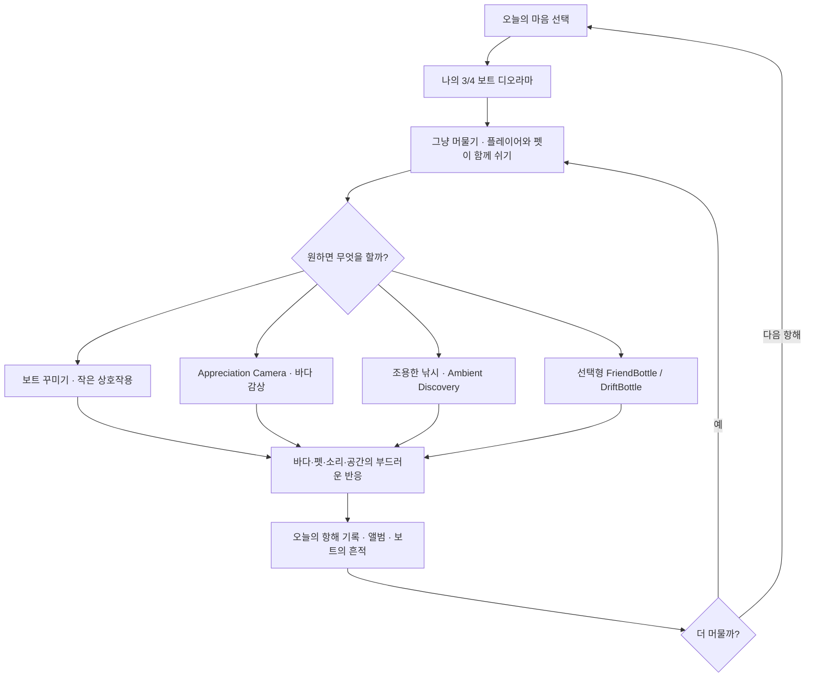

# Human Learning Home + AI Operations Surface Implementation Plan

> **For agentic workers:** REQUIRED SUB-SKILL: Use superpowers:subagent-driven-development (recommended) or superpowers:executing-plans to implement this plan task-by-task. Steps use checkbox (`- [ ]`) syntax for tracking.

**Goal:** Reorganize My Little Boat's Notion workspace so the project Home is a self-contained player-facing learning/flow surface, while operational status and evidence live on a separate AI/System surface, and stale human-facing canon is corrected without changing gameplay or absorbing concurrent PR #19.

**Architecture:** Reuse the existing Notion Human Home and System Record instead of creating a third authority surface. Keep repository structured/runtime truth unchanged unless a repository mirror is already the owner; this task changes human-facing projections plus the approved spec/plan only. Every Notion write is bounded, followed by exact destination readback and cross-surface conflict search.

**Tech Stack:** Notion Human Home + Notion System Record, GitHub Markdown design/plan mirror, GitHub connector, Notion connector, Base `DOMAIN_SPLIT_CANON`, IRG evidence layers.

**Spec:** `docs/superpowers/specs/2026-08-25-human-learning-home-ai-operations-design.md`

## Global Constraints

- Baseline project `main`: `00b943159bb91c8e5279bccb67875fc44ef8e53f`.
- Baseline Base `main`: `ceb83c680f76fead5811956bd6503fd5e4da8577`.
- Current-task branch: `plan/human-learning-home-20260825`.
- PR #19 `Implement deterministic local social fake backend` is `READ_ONLY / NO ABSORPTION`.
- Do not modify Godot code, scenes, scripts, resources, save data, backend runtime, or gameplay behavior.
- Do not generate, edit, or promote a representative image; approved visual remains pending.
- Do not claim Human mobile comfort, audio quality, player fun, retention, or the five-minute emotional experience is verified.
- Do not create a standalone HTML dashboard, active Google Sheet workspace, or third project authority surface.
- Human Home teaches the game; exact SHA/PR/CI/IRG/runtime/queue metadata belongs on the AI/System surface.
- Repository runtime truth remains authoritative for implementation claims; Notion is the human-facing projection.
- Public `DriftBottle` remains blocked behind moderation, Terms/Community Guidelines, 16+ gating, report/block, support, and release verification.
- No realtime/global/public chat, follower/ranking system, social-pressure mechanics, combat, failure/death, ads, payments, chores, streak pressure, pet-neglect penalties, decor stats/gacha/FOMO.
- Every Notion write requires exact destination readback before the task is considered complete.
- Completion requires at least five full-scope adversarial loops on the final state lineage and clean exit.

---

## File / Surface Map

### Repository files

- Existing spec, no semantic rewrite unless a verified omission is found: `docs/superpowers/specs/2026-08-25-human-learning-home-ai-operations-design.md`.
- This implementation plan: `docs/superpowers/plans/2026-08-25-human-learning-home-ai-operations.md`.
- No gameplay/runtime file is in scope.

### Notion human-facing surfaces

- Human Home: `3c41b237-eb1c-8194-8b8e-d88362cafafa` — owns self-contained game explanation, full flow, system relationship, visual direction summary, benchmark learning, protection lines, AI interpretation, edit guide, drilldowns.
- Visual Bible: `3c11b237-eb1c-81ae-97f3-dc28a0905304` — correct stale first-person/no-visible-body protection text and align visual direction to the approved visible-avatar 3/4 diorama while preserving evidence limits.
- Benchmark Library: `3c11b237-eb1c-8116-9c53-e3662be2e347` — correct stale `Kind Words` rejection and explicitly separate old superseded prohibition from current delayed-bottle decision.
- UI / Voyage Flow Map: `3c11b237-eb1c-81c3-8e12-d3f598113c7e` — replace the old sea-first primary flow with the approved boat-diorama/rest-life flow and retain explicit implementation/evidence ceiling notes.

### Notion AI/System surfaces

- Existing System Record: `3c01b237-eb1c-805f-88f3-f30623b4990b` — remains project identity, repository, sync/runtime metadata owner.
- Create one child page under System Record: `AI · 작업 현황 · Evidence` — owns workstream inventory, IRG/evidence, runtime/validation state, sync receipts, blockers/NOT_RUN, next implementation work, incident/lesson locators.

---

### Task 1: Re-read Notion syntax and exact current destinations

**Files / Surfaces:**
- Read: Notion enhanced Markdown specification.
- Read: Human Home, System Record, Visual Bible, Benchmark Library, UI Flow Map.
- Read-only overlap: GitHub PR #19 metadata.

**Interfaces:**
- Consumes: approved design spec and current branch identity.
- Produces: exact bounded edit anchors and confirmation that no target changed materially since planning.

- [ ] **Step 1: Fetch the Notion enhanced Markdown specification**

Use the Notion `fetch` action with `notion://docs/enhanced-markdown-spec`. Do not guess syntax.

- [ ] **Step 2: Fetch all five existing Notion target pages immediately before writing**

Expected evidence:

```text
Human Home still contains operational-status-heavy section(s)
System Record still identifies itself as SYSTEM RECORD / user Home not here
Visual Bible still contains the stale no-visible-body direction OR has already been corrected
Benchmark Library still contains the stale online/UGC blanket rejection OR has already been corrected
UI Flow Map still contains the old sea-first primary flow OR has already been corrected
```

If any target already changed, classify the delta as `ALREADY_FIXED`, `COMPATIBLE_NEWER_STATE`, or `CONFLICT_REQUIRES_REPLAN`; never overwrite a newer compatible decision.

- [ ] **Step 3: Re-fetch PR #19 read-only**

Verify it is still outside this task. If it merged into `main`, treat the merged result only as current implementation evidence; do not edit or absorb its branch.

- [ ] **Step 4: Record IRG baseline**

```text
DISCOVERY: PASS
CALLABLE: PASS only for Notion actions actually exposed
INVOCATION: NOT_RUN until the first write
DURABLE READBACK: NOT_RUN until destination fetch
RUNTIME/HUMAN: NOT_APPLICABLE for document-only changes; existing gameplay Human evidence remains NOT_RUN
```

---

### Task 2: Create the AI Operations Surface first

**Files / Surfaces:**
- Parent: System Record `3c01b237-eb1c-805f-88f3-f30623b4990b`.
- Create: child page `AI · 작업 현황 · Evidence`.

**Interfaces:**
- Consumes: current System Record metadata and exact GitHub state.
- Produces: destination for operational material removed from Human Home.

- [ ] **Step 1: Create the child page under the System Record**

Use this information architecture; values that can be read exactly should be filled from current evidence, and unavailable facts must stay `NOT_RUN`, `NOT_RECORDED`, or `BLOCKED_UNVERIFIED` rather than invented.

```markdown
<callout icon="🤖" color="purple_bg">
**AI/System 작업면** · 이 페이지는 작업 현황·검증·동기화·실행 Evidence를 위한 운영 화면입니다. 게임 전체 설명과 플레이어용 학습 내용은 `마이 리틀 보트 · Home`에서 관리합니다.
</callout>

## Current Identity
- Project Key: `MY_LITTLE_BOAT`
- Repository: `alsdmlals4-eng/MylittleBoat`
- Human Home: `마이 리틀 보트 · Home`
- Current GitHub main: exact readback value

## Workstream Inventory
- current-task: Human Learning Home + AI Operations Surface
- concurrent/open work: exact read-only PR inventory
- other-workstream policy: `READ_ONLY / NO ABSORPTION` unless explicitly authorized

## Implementation Reality Gate
<table fit-page-width="true" header-row="true">
<tr><td>Evidence layer</td><td>Meaning</td><td>Current rule</td></tr>
<tr><td>DISCOVERED</td><td>surface/source exists</td><td>not completion</td></tr>
<tr><td>CALLABLE / IMPLEMENTED</td><td>usable schema or implementation exists</td><td>not completion</td></tr>
<tr><td>INVOKED / EXECUTED</td><td>actual action ran</td><td>still requires durable effect when applicable</td></tr>
<tr><td>DURABLE EFFECT / READBACK</td><td>destination/source reflects result</td><td>document completion ceiling</td></tr>
<tr><td>RUNTIME / CLIENT / HUMAN</td><td>actual runtime or human observation</td><td>remain NOT_RUN unless directly observed</td></tr>
</table>

## Runtime / Validation State
- repository/runtime facts: link to source owners, do not duplicate full game explanation
- Human mobile comfort: `NOT_RUN`
- five-minute emotional experience: `NOT_RUN`
- final representative visual: `NOT_APPROVED / NOT_INTEGRATED`

## Sync / Readback Receipts
- keep date, exact destination, source owner, result, and evidence ceiling for each material sync

## Blockers / NOT_RUN / Next Work
- operational queue only; this section is intentionally absent from the Human Home's primary hierarchy

## Incident / Lesson Locators
- record only material repeatable incidents and reusable lessons
```

- [ ] **Step 2: Fetch the created page by returned ID**

Expected: title, parent System Record, content, and all IRG labels are present.

- [ ] **Step 3: Verify authority separation**

Expected:

```text
AI page contains operations/evidence
AI page does not become a second narrative GDD
Human Home remains the narrative owner
```

- [ ] **Step 4: Add a direct AI Operations child-page link to the existing System Record only if the created child is not already visible/discoverable there**

Do not add this operational link to the Human Home's primary learning hierarchy.

---

### Task 3: Rewrite the Human Home as a self-contained learning surface

**Files / Surfaces:**
- Modify: Human Home `3c41b237-eb1c-8194-8b8e-d88362cafafa`.

**Interfaces:**
- Consumes: approved spec, current human-facing decisions, current drilldown page URLs.
- Produces: full game learning surface without operational dashboard metadata.

- [ ] **Step 1: Replace the operationally mixed Home body with the approved learning hierarchy**

Preserve child/drilldown page references. The Home must contain, in order:

```text
1. 30-second game understanding
2. full game flow map
3. player experience map
4. five-minute stay rhythm
5. core system relationship map
6. optional activities / pressure budget
7. memory and attachment loop
8. delayed bottle social
9. visual / UX direction
10. benchmark learning
11. experience protection lines
12. AI interpretation for user correction
13. human edit guide
14. 4–6 domain drilldowns
```

Use the approved flow verbatim in meaning:



Add an explicit note beside the flow:

```text
이 Flow는 승인된 전체 게임 기획을 설명하는 학습 지도이며, 모든 노드가 현재 구현 완료되었다는 뜻이 아닙니다. 실제 구현·검증 상태는 별도 AI/System 작업면과 repository runtime evidence에서 관리합니다.
```

- [ ] **Step 2: Build the player-experience table**

Use four columns:

```text
단계 | 플레이어가 보는 것 | 선택할 수 있는 것 | 느끼고 기억해야 하는 것
```

Cover at least mood entry, resting diorama, optional boat life, appreciation/discovery, delayed human warmth, memory/return.

- [ ] **Step 3: Remove primary operational metadata from Home**

Ensure these no longer occupy Home sections:

```text
exact SHA
PR lineage/status
CI receipt/run numbers
raw technical PASS matrix
runtime binding
next implementation task/queue
prompt/hash/tool routing
raw IRG ledger
sync receipts
```

A short sentence may direct operators to the System Record, but the Home must not repeat the data.

- [ ] **Step 4: Preserve evidence ceilings in human language**

Home must still say:

```text
approved representative visual pending
five-minute Human comfort NOT_RUN
actual smartphone readability/input NOT_RUN
technical placeholder != final healing experience proof
```

Do not turn these into an engineering status dashboard.

- [ ] **Step 5: Fetch Human Home and verify self-containment**

Acceptance questions:

```text
Can a new reader explain the fantasy and emotional promise?
Can they trace the complete game flow?
Can they distinguish core rest from optional activities?
Can they explain why bottles are delayed and bounded?
Can they identify visual direction without assuming final art exists?
Can they understand what changes require design approval?
Is operational status absent from the primary hierarchy?
```

---

### Task 4: Correct the Visual Bible stale canon

**Files / Surfaces:**
- Modify: Visual Bible `3c11b237-eb1c-81ae-97f3-dc28a0905304`.

**Interfaces:**
- Consumes: current visible-avatar 3/4 diorama canon and existing visual evidence limits.
- Produces: human-facing visual direction consistent with current Home and repository canon.

- [ ] **Step 1: Replace the stale protected direction**

Remove/replace the superseded statement:

```text
플레이어 몸은 보이지 않음
```

with current meaning:

```text
평상시 화면은 보이는 플레이어 캐릭터 + 펫 + 꾸민 보트 + 바다가 함께 읽히는 차분한 3/4 디오라마를 기본으로 합니다.
Appreciation Camera에서는 바다/수평선 집중을 위해 캐릭터·펫이 가장자리로 밀리거나 화면 밖으로 나갈 수 있습니다.
```

- [ ] **Step 2: Preserve still-valid rest-first visual rules**

Retain stable horizon, low-density ambient movement, comfortable pet presence, readable UI contrast, reduced/bounded bob, no excessive flashing/shake, and evidence-gate language.

- [ ] **Step 3: Add boat-space composition constraint**

State that decoration/avatar/pet must remain legible without hiding the sea/horizon or turning the composition into inventory clutter.

- [ ] **Step 4: Fetch Visual Bible and search for residual stale first-person/no-body wording**

Expected: no active current-direction statement contradicts visible-avatar 3/4 normal play. Historical context may remain only when explicitly labeled superseded/history.

---

### Task 5: Correct the Benchmark Library stale social decision

**Files / Surfaces:**
- Modify: Benchmark Library `3c11b237-eb1c-8116-9c53-e3662be2e347`.

**Interfaces:**
- Consumes: approved delayed-bottle design and current safety/release gates.
- Produces: benchmark reasoning aligned with the current product direction without claiming causality from popularity.

- [ ] **Step 1: Replace the stale Kind Words disposition**

Superseded meaning:

```text
REJECT · 현재 프로젝트 금지선에 따라 온라인/UGC 편지 교환은 도입하지 않고 로컬 큐레이션 문구 유지.
```

Current meaning:

```text
ADAPT · 비동기 편지가 ‘혼자 있지만 혼자가 아닌’ 정서를 만드는 원리를 FriendBottle/DriftBottle의 느린 편지 경험으로 변형합니다. REJECT · 실시간 채팅·온라인 상태·타이핑·읽음 표시·공개 피드·팔로워/인기 경쟁. Stranger UGC는 production moderation·Terms/Community Guidelines·16+·report/block·support gate가 검증되기 전 공개하지 않습니다.
```

- [ ] **Step 2: Add/refresh the Bondee warning if the page does not already represent it**

Human-facing conclusion only:

```text
ADAPT · 아바타와 작은 개인 공간이 주는 빠른 애착/첫인상.
WARNING / REJECT · 소셜 novelty 자체를 장기 retention 코어로 간주하거나 신뢰·안전·지속적인 머무름 이유 없이 복제하지 않음.
```

Do not claim download/review numbers as causal proof.

- [ ] **Step 3: Preserve prior valid benchmark lessons**

SEASON, NAIAD, Eastshade, fishing trade study, and rest-first audio/visual/pet principles remain unless directly contradicted by current canon.

- [ ] **Step 4: Fetch Benchmark Library and search for active blanket prohibition language**

Expected: no current decision says all online/UGC bottle exchange is forbidden. Safety-bounded rejection of realtime/public-pressure social remains.

---

### Task 6: Correct the UI / Voyage Flow Map

**Files / Surfaces:**
- Modify: UI Flow Map `3c11b237-eb1c-81c3-8e12-d3f598113c7e`.

**Interfaces:**
- Consumes: approved whole-game flow and current implementation evidence ceiling.
- Produces: drilldown flow consistent with Home, while distinguishing whole-design flow from current implementation.

- [ ] **Step 1: Replace the primary flow**

Use:

```text
오늘의 마음 선택
→ 3/4 보트 디오라마 진입
→ 플레이어·펫과 그냥 머물기
↔ 보트 꾸미기·저압력 상호작용
↔ Appreciation Camera
↔ 조용한 낚시·Ambient Discovery
↔ 선택형 FriendBottle / DriftBottle
→ 오늘의 항해 기록·앨범·보트 흔적
→ 계속 머물기 또는 다음 항해
```

- [ ] **Step 2: Separate design flow from implementation evidence**

Add a short section explaining:

```text
전체 기획 Flow: current approved product direction
현재 구현 Evidence: repository/runtime owner가 별도로 증명
```

Do not display raw CI/PR queue here.

- [ ] **Step 3: Preserve implementation truths that remain useful to a human reader**

Examples allowed when phrased as behavior, not operations:

- Appreciation Camera must not reset voyage state.
- album round-trip must preserve the current voyage.
- fishing has no failure penalty.
- ignored optional activity does not create loss.

- [ ] **Step 4: Fetch Flow Map and compare its semantics to Human Home**

Expected: same top-level player journey; drilldown contains more interaction detail but no contradictory product direction.

---

### Task 7: Cross-surface reference freshness and authority audit

**Files / Surfaces:**
- Read back: Human Home, System Record, AI Operations page, Visual Bible, Benchmark Library, UI Flow Map.
- Search: project Notion for stale phrases.
- Read-only: repository `AGENTS.md`, `docs/CONCEPT.md`, approved delayed-bottle spec, PR #19 state.

**Interfaces:**
- Consumes: Tasks 2–6 outputs.
- Produces: reconciled human-facing canon with no known active stale contradiction in the audited scope.

- [ ] **Step 1: Search Notion for stale visible-avatar conflicts**

Search terms:

```text
"플레이어 몸은 보이지 않음"
"first-person-only"
"플레이어 캐릭터 비표시"
```

Classify hits as current contradiction, historical superseded record, or unrelated context.

- [ ] **Step 2: Search Notion for stale social blanket prohibitions**

Search terms:

```text
"온라인/UGC 편지 교환은 도입하지"
"온라인 병편지 금지"
"UGC 편지 금지"
```

Do not remove current release safety gates.

- [ ] **Step 3: Search Notion for obsolete sea-first primary flow wording**

Search terms:

```text
"오늘의 마음 선택 → 바다 진입"
"first-person sea"
```

Historical source may remain if explicitly marked as superseded; active current instruction must not conflict.

- [ ] **Step 4: Reconcile repository structured canon**

Verify `AGENTS.md`, `docs/CONCEPT.md`, and the approved delayed-bottle spec already express visible-avatar 3/4 + Appreciation Camera + bounded delayed social. If repository canon is already correct, make **no gratuitous repository semantic edit**.

- [ ] **Step 5: Reconcile Home vs AI Operations separation**

Expected:

```text
Human Home = product learning / design understanding
AI Operations = status / evidence / current work
System Record = identity and synchronization owner
Repository = structured/runtime truth
```

---

### Task 8: Full adversarial review until clean

**Files / Surfaces:**
- Entire final state from Tasks 2–7.

**Interfaces:**
- Consumes: all candidate outputs.
- Produces: validated findings only, corrected state, and clean-exit evidence.

Perform at least five **full-scope** loops. Each loop must re-attack all material dimensions, not one lens per loop.

For each loop record:

```yaml
loop_index:
input_state:
evidence_delta: []
full_scope_findings: []
validated_findings: []
changes_applied: []
verification: []
better_alternative_result:
long_term_fit:
unresolved: []
clean_exit_candidate:
```

- [ ] **Loop 1: Whole-state authority and stale-canon attack**
- [ ] **Loop 2: Whole-state user-learning clarity / operation-leak attack**
- [ ] **Loop 3: Whole-state gameplay/evidence overclaim and safety-boundary attack**
- [ ] **Loop 4: Whole-state duplication/maintenance/1-person-development-cost attack**
- [ ] **Loop 5: Whole-state omission, untouched-consumer, better-alternative, long-term-fit attack**

After loop 5, continue loop 6..N if any new valid blocking finding remains.

Acceptance for clean exit:

```text
new valid MUST_FIX/P0/P1 = 0
current user decision conflicts = 0
known active stale canon in audited scope = 0
Human Home operational leakage = 0 material leakage
AI Operations narrative-canon duplication = 0 material duplication
PR #19 mutation/absorption = 0
runtime/human overclaim = 0
required destination readbacks = PASS
```

---

### Task 9: GitHub current-task PR and exact-head review

**Files:**
- Spec and plan files on `plan/human-learning-home-20260825`.
- No unrelated repository files.

**Interfaces:**
- Consumes: clean Notion final state and exact branch state.
- Produces: reviewable current-task PR for the durable GitHub design/plan mirror.

- [ ] **Step 1: Re-read GitHub `main`**

If `main` moved, compare changes. Do not absorb PR #19 branch directly. If merged main contains compatible new implementation facts, update only evidence references that have become stale and keep product design unchanged.

- [ ] **Step 2: Compare current-task branch to latest `main`**

Expected scope: design spec + implementation plan only, unless a validated repository-canon omission required a minimal additional doc correction.

- [ ] **Step 3: Create the current-task PR**

Title:

```text
Reframe My Little Boat project home for human learning
```

Body must report:

```text
Human Home / AI Operations split
stale Visual / Benchmark / Flow corrections
No gameplay/runtime changes
No PR #19 absorption
Notion destination readback results
IRG evidence ceiling
five-loop adversarial review result
```

- [ ] **Step 4: Verify exact PR HEAD and repository checks/rules**

Do not reuse checks from another SHA. If the repository has no required checks for docs-only changes, report that fact rather than inventing a check name.

- [ ] **Step 5: Review changed files / diff for scope**

Expected: no code, scene, resource, test, dependency, or unrelated cleanup changes.

---

### Task 10: Merge and post-merge readback

**Files / Surfaces:**
- GitHub current-task PR.
- GitHub new `main`.
- All Notion destinations.

**Interfaces:**
- Consumes: exact-head clean PR and clean Notion state.
- Produces: merged main identity plus durable cross-surface completion evidence.

- [ ] **Step 1: Merge only the current-task PR through a repository-supported normal merge route**

Forbidden:

```text
force push
direct main push
admin/ruleset bypass
modify/merge PR #19 as part of this task
```

- [ ] **Step 2: Fetch new GitHub `main` and exact merge SHA**

Do not claim merge complete until new `main` contains the spec/plan commit lineage.

- [ ] **Step 3: Post-merge fetch all Notion destinations**

Verify:

```text
Human Home still has learning hierarchy
AI Operations exists under System Record
Visual Bible visible-avatar canon is current
Benchmark Library delayed-bottle disposition is current
UI Flow Map is current
no post-merge drift was introduced
```

- [ ] **Step 4: Re-run same-goal open/recent PR check**

PR #19 remains an independent workstream unless it independently merged; this task does not take it over.

- [ ] **Step 5: Final IRG / completion ledger**

Record at minimum:

```yaml
project: MY_LITTLE_BOAT
approved_scope: Human Learning Home + AI Operations Surface
exact_base_main: 00b943159bb91c8e5279bccb67875fc44ef8e53f
changed_scope:
  github: design spec + implementation plan
  notion: Human Home + AI Operations + Visual Bible + Benchmark Library + UI Flow Map
tests_and_results: document/readback/adversarial evidence only
godot_runtime: NOT_RUN_NOT_APPLICABLE_TO_DOC_ONLY_CHANGE
human_player_evidence: NOT_RUN
notion_readback: PASS required
current_task_pr:
exact_review_head:
required_checks:
merge_sha:
new_main_readback:
remaining_required_work:
final_adversarial_state:
blockers: []
```

- [ ] **Step 6: Remaining-work recalculation and completion correction rescan**

If any valid omission/conflict/complement gap appears, reopen the minimum necessary task, fix it, read back, and continue adversarial review. Only report completion after remaining required work is 0 and the final state has clean exit.

---

## Plan Self-Review Result

### Spec coverage

- Two-surface Human/AI split: Task 2 + Task 3.
- Full game learning hierarchy: Task 3.
- Stale Visual canon: Task 4.
- Stale Benchmark social decision: Task 5.
- Old sea-first Flow: Task 6.
- No new authority surface: Global Constraints + Task 2.
- No image generation: Global Constraints + Task 3 evidence wording.
- PR #19 read-only: Global Constraints + Tasks 1, 7, 9, 10.
- IRG: Tasks 1, 2, 10.
- Destination readback: every Notion mutation task.
- Minimum five full adversarial loops: Task 8.
- PR, exact-head, merge, postmerge: Tasks 9–10.
- Human/player evidence ceiling: Global Constraints + Tasks 3, 8, 10.

### Placeholder scan

No `TBD`, `TODO`, `implement later`, unspecified test steps, or invented runtime claims are used as executable plan instructions. Dynamic facts such as final merge SHA are explicitly required to be populated by readback rather than guessed.

### Scope check

The work has two surfaces but one information-architecture decision and one acceptance boundary. Splitting it into independent project plans would increase cross-surface drift and duplicate the same authority audit, so it remains one implementation plan with independently verifiable tasks.
