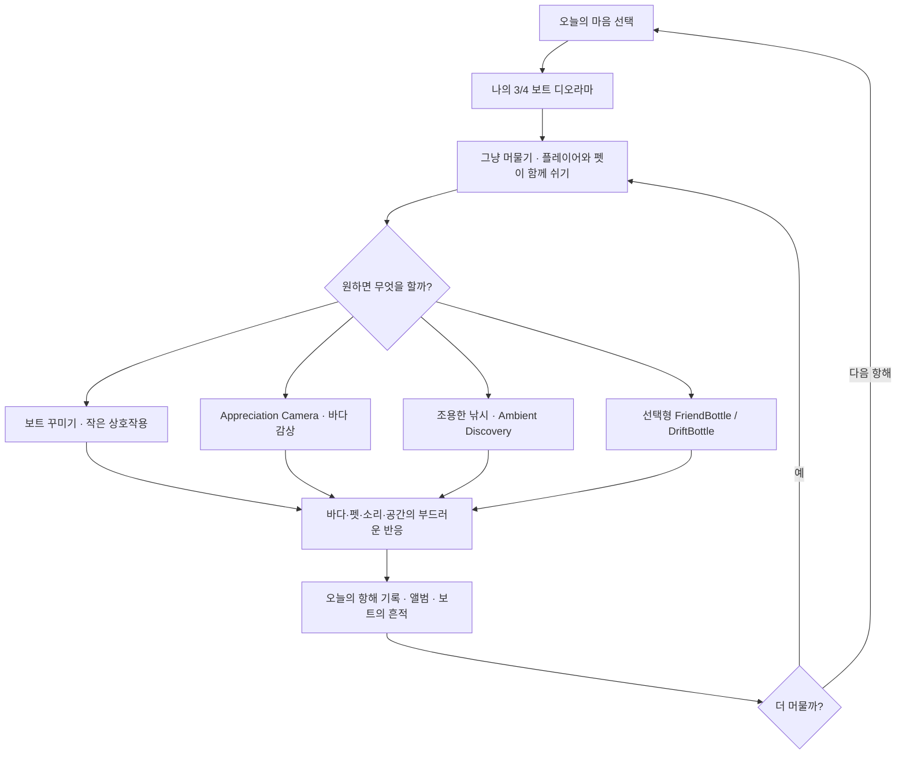

# Human Learning Home + AI Operations Surface Design

Status: **USER-APPROVED DESIGN / SPEC REVIEW GATE**  
Date: 2026-08-25  
Project: `my little boat` / `MY_LITTLE_BOAT`  
Baseline project `main`: `00b943159bb91c8e5279bccb67875fc44ef8e53f`  
Baseline Base `main`: `ceb83c680f76fead5811956bd6503fd5e4da8577`  
Current-task branch: `plan/human-learning-home-20260825`  
Concurrent PR boundary: PR #19 `Implement deterministic local social fake backend` is **READ_ONLY / NO ABSORPTION** for this task.

## 0. Decision summary

The approved information architecture is a two-surface split:

1. **Human Learning Home** — the page opened when the user selects the project. It teaches the whole game through player-facing flow, systems, emotional intent, visual direction, benchmark reasoning, and edit guidance.
2. **AI Operations Surface** — separate AI/system workspace for work status, SHA/PR/CI, IRG evidence, blockers, runtime state, sync receipts, next implementation work, and other operational metadata.

The Human Home must not become a development status dashboard. The AI Operations Surface must not become a second human-facing design canon.

This design reuses the existing Notion Project Home and System Record instead of creating a new HTML dashboard, Google Sheet workspace, or third authority surface.

## 1. Authority and evidence

Authority order for this design:

1. latest user instruction and explicit approval of the recommended option;
2. project `AGENTS.md` and current repository/runtime constraints;
3. current Notion Human Home and approved human-facing decisions;
4. repository structured canon and actual implementation evidence;
5. Base current owners and Skill routing;
6. fresh external benchmarks and platform policy evidence;
7. inference.

Current project facts used by this design:

- normal play is a visible-avatar + pet + boat + sea **3/4 Boat Diorama**;
- `Appreciation Camera` remains the optional sea-focused low-UI view;
- rest is the product promise; optional systems must not create loss, chores, optimization pressure, or response pressure;
- boat decoration is self-expression/memory rather than stats;
- delayed bottle social is not realtime chat and remains isolated from the local rest loop;
- public `DriftBottle` remains blocked behind moderation, Terms/Community Guidelines, 16+ gating, report/block, support, and release verification;
- no final representative visual is currently approved for Home placement;
- actual Human 5-minute comfort/mobile validation remains `NOT_RUN`.

## 2. Problem statement

The current workspace has the correct high-level domain split, but the human-facing projections are no longer fully synchronized with the latest approved direction.

### 2.1 Human Home mixes product understanding and operational status

The current Home correctly explains the rest-first 3/4 diorama direction, but it also contains detailed implementation lineage such as PR numbers, exact `main` SHA, technical PASS states, next implementation priority, and runtime gaps.

Those details change frequently and make the page act partly like a development dashboard. The user's latest instruction is stricter: when the project is selected, the main page should be a **user-facing full game flow map + visual/text learning surface**, while work status belongs on an AI-only page.

### 2.2 Visual Bible contains stale first-person canon

The current Visual Bible still contains the protected direction `플레이어 몸은 보이지 않음`, which conflicts with the later approved visible-avatar 3/4 diorama direction and the current repository canon.

### 2.3 Benchmark Library contains stale social prohibition

The current `Kind Words` disposition still rejects online/UGC letters because of an older project prohibition. That prohibition was superseded by the approved `FriendBottle` / `DriftBottle` design with explicit safety gates.

### 2.4 UI Flow Map still describes the older sea-first flow

The current flow starts as `오늘의 마음 선택 → 바다 진입 → 5분 항해...` and underrepresents the now-primary visible-avatar boat-living layer: resting with avatar/pet, decorating the boat, low-pressure interactions, and delayed bottle correspondence.

## 3. Goals

The implementation must achieve all of the following.

### 3.1 Human Home is self-contained learning material

A user reading only the Home should be able to explain:

- what the game is;
- what the player emotionally comes for;
- the whole player flow from mood choice to continued resting / next voyage;
- how rest, avatar, pet, boat, sea, audio, decoration, interaction, discovery, fishing, records/album, and delayed bottles relate;
- which systems are core versus optional;
- why the design avoids competition, FOMO, chores, realtime social pressure, and optimization;
- the current visual direction and its evidence limits;
- the key benchmark principles adopted/adapted/rejected;
- how the user can request a wording/layout change, a design rule change, or an image change.

### 3.2 Operational metadata is moved off the Human Home

The following should not occupy the Human Home's primary information hierarchy:

- exact Git SHA;
- PR lineage and open PR status;
- CI/check receipts;
- raw technical PASS matrix;
- runtime/binding state;
- next coding task or implementation queue;
- prompt/hash/tool routing/debug metadata;
- raw IRG ledger;
- operational synchronization receipts.

These belong on the AI Operations Surface.

### 3.3 Stale human-facing canon is corrected

Visual Bible, Benchmark Library, and UI Flow Map must align with the latest approved product direction without erasing historical reasoning.

### 3.4 No new authority surface is introduced

Do not create a standalone HTML dashboard, local project-management UI, active Google Sheet workspace, or duplicated full GDD.

## 4. Non-goals

This task does **not**:

- modify Godot gameplay, scenes, scripts, resources, save data, social backend, or runtime behavior;
- modify or absorb PR #19;
- implement Supabase, Auth, RLS, moderation, network delivery, or final social UI;
- create or edit game art;
- generate a representative Home image;
- claim Human mobile comfort, audio quality, player fun, or 5-minute emotional validation;
- replace repository runtime truth with Notion prose;
- create a universal template that forces irrelevant data sections onto the project.

## 5. Selected architecture

### 5.1 Surface A — Human Learning Home

Existing page:

- `마이 리틀 보트 · Home`
- Notion page ID: `3c41b237-eb1c-8194-8b8e-d88362cafafa`

Primary job: **teach the game, not report development operations**.

The page should follow a three-depth reading model:

```text
30 seconds
→ understand fantasy, emotional promise, core loop

5 minutes
→ understand the complete player flow, system relationships, visual/UX principles, memory loop, delayed social role

drilldown
→ open Visual / Voyage / Systems / Benchmark detail only when needed
```

### 5.2 Surface B — AI Operations Surface

Existing parent/system owner:

- `마이 리틀 보트 (My Little Boat)` System Record
- Notion page ID: `3c01b237-eb1c-805f-88f3-f30623b4990b`

The existing System Record remains the project identity and synchronization owner.

Create one child page under it:

- suggested title: `AI · 작업 현황 · Evidence`

Primary job: **operational truth and evidence navigation**.

It may contain:

- current GitHub main SHA;
- current-task and same-goal PR inventory;
- CI/check/evidence receipts;
- IRG ledger and evidence ceilings;
- Notion↔GitHub sync receipt;
- runtime/binding state;
- blockers and `NOT_RUN` items;
- next implementation work;
- incident/lesson links;
- exact source locators needed by AI/Codex.

It must not duplicate the Human Home's narrative explanation of the game.

## 6. Human Home information architecture

The new Home should use the following sequence.

### Section 1 — 30-second game understanding

Show:

- one-line fantasy;
- player promise;
- core emotional targets;
- one concise statement of the product boundary: **the goal is to rest, not win**.

Recommended summary meaning:

> A small boat diorama where the visible player avatar and pet quietly live, rest, decorate, watch the sea, collect personal memories, and sometimes feel another person's warmth through slowly drifting bottle letters.

### Section 2 — Full Game Flow Map

The main Home flow should represent the **whole approved game experience**, not only the currently implemented slice.



The flow itself is a design map. It must not imply every node is currently implemented.

### Section 3 — Player experience map

For each major phase, explain four questions:

```text
What does the player see?
→ What can the player choose to do?
→ What responds?
→ What should the player feel/remember?
```

Use a compact table rather than a feature checklist.

### Section 4 — The five-minute stay

Explain the intended session rhythm as emotional pacing, not a task timer.

Suggested rhythm:

1. settle in;
2. notice avatar/pet/boat/sea;
3. optionally interact or do nothing;
4. encounter low-density change/discovery;
5. leave a small personal trace;
6. continue resting or start another voyage.

Do not claim that the intended five-minute experience is validated. Human evidence remains `NOT_RUN` until directly tested.

### Section 5 — Core system relationship map

The center of the system is **Resting Sanctuary**, not currency, XP, or completion percentage.

```text
Resting Sanctuary
├─ Sea / Horizon / Weather / Light
├─ Persistent Wave-first Soundscape
├─ Visible Avatar
├─ Resting Pet
├─ Personal Boat Space
│  ├─ Decoration
│  └─ Low-pressure Interaction
├─ Appreciation Camera
├─ Optional Discovery / Quiet Fishing
├─ Voyage Record / Album / Boat Memory
└─ Delayed Bottle Social
```

Clarify that delayed social is a supporting presence layer, not the product's primary social network.

### Section 6 — Optional activities and pressure budget

Explain why the player may ignore:

- fishing;
- discovery;
- decoration;
- prop/pet interactions;
- photos;
- delayed letters.

Ignoring them must not create loss, streak breakage, pet neglect, missed progression, social punishment, or efficiency disadvantage.

### Section 7 — Memory and attachment loop

Explain how the project intends to create return motivation without pressure:

```text
오늘의 마음
→ 오늘 머문 공간
→ 작은 발견/상호작용
→ 기록/앨범/보트 흔적
→ "내가 여기서 보낸 시간"이 누적
→ 다음에 다시 머물 이유
```

This is the intended retention principle. It is not yet evidence of actual retention.

### Section 8 — Delayed Bottle Social

Explain the fantasy first, implementation second.

Human-facing meaning:

- `FriendBottle`: a slow letter to an approved friend;
- `DriftBottle`: a limited letter that may arrive from another quiet boat;
- no presence, typing, read receipt, public feed, followers, ranking, or global chat;
- local rest gameplay remains available without the backend;
- public stranger letters remain disabled until safety/release gates are proven.

Avoid exposing raw backend tables, function names, CI status, or implementation queue here.

### Section 9 — Visual / UX direction

Summarize the current approved visual direction:

- visible player + pet + boat + sea in a calm 3/4 diorama;
- stable horizon;
- low-to-medium environmental contrast, while text/actions retain readable contrast;
- slow and bounded movement;
- low-density ambient life;
- decoration must not hide the sea;
- Appreciation Camera reduces UI intervention;
- avatar/pet/boat attachment is part of the primary presentation.

If no approved representative visual exists, show an explicit `APPROVED VISUAL PENDING` state rather than generating or promoting a placeholder.

### Section 10 — Benchmark learning

Keep only player-relevant benchmark reasoning on Home.

Recommended synthesis:

- **Spirit City: Lofi Sessions — ADAPT**: ambient space + companion + personalization can be the value itself; reject productivity/XP pressure as core.
- **Kind Words — ADAPT**: asynchronous human warmth can matter without realtime social pressure; adapt through bounded delayed bottles and safety gates.
- **Bondee — ADAPT / WARNING**: strong avatar/private-space first impression is useful; do not rely on social novelty alone for long-term value.
- **NAIAD / A Short Hike / SEASON / Eastshade — selective ADAPT**: slowness, scenery, discovery, memory capture, and friction lessons support the rest-first experience.

Detailed source/evidence tables remain in the Benchmark drilldown page.

### Section 11 — Experience protection lines

Human-readable protection rules:

- no combat/failure/death;
- no competitive score/ranking;
- no compulsory daily chores or streak pressure;
- no pet hunger/cleaning/neglect penalty;
- no decor stat optimization/gacha/FOMO shop pressure;
- no realtime/global/public chat;
- no popularity/follower loop;
- no backend dependency for the core rest loop;
- no claim that technical placeholders prove the final healing experience.

### Section 12 — AI interpretation for user correction

Keep a short human-facing statement of what the AI believes the design intent is.

It should answer:

> What does the AI think must never be lost when details change?

It must not include prompt hashes, internal Skill routing, exact implementation paths, or raw CI.

### Section 13 — Human edit guide

Separate three change types.

1. **Explanation/layout only** — edit the Notion human expression and read it back.
2. **Game rule/design change** — impact audit → before/after/effect → user approval → repository structured canon sync → Notion sync → implementation/verification.
3. **Image generation/edit** — current Visual canon review → text brief → stop → explicit next-message approval → exactly one image.

### Section 14 — Drilldown links

Keep 4–6 meaningful domains rather than exposing every operational detail on Home.

Existing domain pages should remain the main drilldowns:

- Direction · Planning;
- Voyage · Experience · Systems;
- Visual · UX · Assets;
- Production · Validation;
- Reference · Benchmark.

Production/Validation remains a drilldown and AI/operator surface, not a primary Home status panel.

## 7. AI Operations Surface information architecture

Create `AI · 작업 현황 · Evidence` as a child of the existing System Record.

Suggested sections:

### A. Current identity

- Project Key;
- repository;
- current main SHA;
- current Notion Human Home;
- Base/adoption locator;
- last synchronized date.

### B. Current workstream inventory

- current-task branch/PR;
- other open PRs as read-only inventory;
- explicit other-worker boundaries;
- current phase / approval reference.

### C. Evidence / IRG

Use explicit layers:

```text
DISCOVERED
→ CALLABLE / IMPLEMENTED
→ INVOKED / EXECUTED
→ DURABLE EFFECT / READBACK
→ RUNTIME / CLIENT / HUMAN OBSERVATION
```

Do not upgrade a lower layer to a higher claim.

### D. Runtime and validation status

May include:

- technical contracts;
- Godot/CI results;
- runtime status;
- Human usability `NOT_RUN`;
- player experience `NOT_RUN`;
- blockers and exact evidence needed.

### E. Next implementation work

Operational queue belongs here, not on Home.

The page may state that PR #19 is a separate read-only workstream and must not be absorbed by this task.

### F. Sync / incidents / lessons

Track:

- Notion↔repository sync receipts;
- stale-canon corrections;
- material incidents and lessons;
- revisit conditions.

## 8. Stale-canon correction set

### 8.1 Visual Bible

Target page:

- `02 · 비주얼 바이블`
- page ID `3c11b237-eb1c-81ae-97f3-dc28a0905304`

Replace the obsolete first-person-only protection with the current hierarchy:

```text
Primary: visible avatar + pet + personalized boat + sea in a calm 3/4 diorama
Optional: Appreciation Camera for sea/horizon focus
```

Preserve valid visual principles such as stable horizon, low-density movement, readable UI, comfortable pet placement, and Human validation gates.

### 8.2 Benchmark Library

Target page:

- `05 · Reference · Benchmark 도서관`
- page ID `3c11b237-eb1c-8116-9c53-e3662be2e347`

Update the old `Kind Words` rejection so it no longer says all online/UGC letters are prohibited.

New disposition:

- `ADAPT`: asynchronous human warmth and low-pressure letter exchange;
- `REJECT`: realtime/global/public social pressure, presence, feed, ranking, popularity;
- `SAFETY GATE`: stranger UGC remains disabled until the approved moderation/report/block/age/support requirements are production-verified.

Do not delete the older research context if it remains useful; correct the superseded project-specific conclusion.

### 8.3 UI Flow Map

Target page:

- `03 · UI · 항해 Flow Map`
- page ID `3c11b237-eb1c-81c3-8e12-d3f598113c7e`

Upgrade the flow from sea-first technical slice language to the current whole-game flow:

```text
마음 선택
→ 3/4 보트 디오라마
→ 쉬기 / 꾸미기 / 작은 상호작용
→ Appreciation / 조용한 낚시 / Ambient Discovery / 선택형 Delayed Bottle
→ 기록 / 앨범 / 보트 흔적
→ 더 머물기 / 다음 항해
```

Then retain a separate note describing which parts are actually implemented versus planned, without letting implementation status redefine the design flow.

## 9. Repository ownership impact

No gameplay/runtime repository owner needs to change solely because of this information-architecture task.

The repository already reflects the current visible-avatar, 3/4 diorama, boat-life, delayed-bottle direction in `AGENTS.md`, `docs/CONCEPT.md`, `docs/RESTING_EXPERIENCE_BIBLE.md`, and the approved delayed-bottle design spec.

Therefore implementation should prefer:

```text
Notion human projection correction
+ AI operations separation
+ destination readback
```

rather than duplicating the full Home prose into another Markdown GDD.

This design spec and later implementation plan are process/evidence artifacts, not a new gameplay canon.

## 10. Alternatives considered

### A. Minimal patch only

Approach:

- remove the existing `현재 상태` section from Home;
- fix a few stale phrases.

Benefits:

- lowest edit cost;
- smallest surface area.

Failure mode:

- does not fully satisfy the requirement that the Home be a user-facing full game flow/visual learning surface;
- leaves the Human Home too close to a summary page rather than a complete learning map.

Disposition: **REJECT**.

### B. Human Learning Home + AI Operations split

Approach:

- restructure the existing Home around the full player experience;
- move operations to a dedicated AI child page under the System Record;
- correct stale Visual/Benchmark/Flow projections.

Benefits:

- satisfies the user's stricter Human-vs-AI surface boundary;
- reuses current Notion structure;
- reduces future Home staleness;
- preserves repository/runtime authority;
- low ongoing cost for a solo project.

Disposition: **SELECTED**.

### C. Database-driven mega dashboard

Approach:

- represent design, status, evidence, systems, and work as linked database/dashboard views.

Benefits:

- dynamic filtering;
- strong operational reporting.

Failure mode:

- over-engineered for the current project scale;
- risks turning the Human Home back into project management UI;
- increases schema and maintenance cost;
- can create a third interpretation layer between Notion human canon and repository truth.

Disposition: **REJECT**.

## 11. Benchmark synthesis

The selected design uses benchmark principles rather than feature copying.

### ADAPT

- ambient space as primary value;
- avatar/companion/personal-space attachment;
- asynchronous warmth without realtime pressure;
- scenery and low-density discovery;
- memory/record as personal trace rather than optimization;
- slow pacing with optional interaction.

### REJECT

- productivity XP or checklist pressure as the rest loop;
- realtime chat, presence, typing, read receipts, public feed, followers, ranking;
- social novelty as the only retention engine;
- forced tasks, loss, or progress friction that turns slowness into punishment;
- copying identifiable art, UI, wording, or trade dress.

## 12. Risks and mitigations

### Risk: Home becomes too long

Mitigation:

- enforce `30 seconds → 5 minutes → drilldown` hierarchy;
- use concise tables/diagrams;
- keep raw evidence and history off Home.

### Risk: whole-game Flow looks like implementation status

Mitigation:

- label the Flow as **approved game design flow**;
- keep actual technical status on AI Operations Surface;
- use explicit `NOT_RUN / NOT_IMPLEMENTED` only where it materially prevents overclaim.

### Risk: stale duplicate facts remain in detail pages

Mitigation:

- update the three confirmed stale human-facing pages in the same implementation package;
- search relevant Notion pages for superseded phrases after edits;
- perform destination readback.

### Risk: operational data leaks back into Home

Mitigation:

- AI Operations Surface becomes the default destination for SHA/PR/CI/IRG/next-work updates;
- Human Home contains only durable player-facing meaning and evidence ceilings needed to prevent misleading claims.

### Risk: final visual is implied without approval

Mitigation:

- keep `APPROVED VISUAL PENDING` until an actual approved asset exists;
- do not generate an image in this task.

### Risk: PR #19 overlap

Mitigation:

- keep PR #19 read-only;
- do not copy, rebase, update, close, merge, or absorb its branch;
- if `main` changes before this task's merge, reconcile only against newly completed `main` and re-run scope/evidence review.

## 13. Implementation Reality Gate

Claims required for completion of this information-architecture task:

### GitHub

```text
branch/file exists
≠ reviewed
≠ PR validated
≠ merged
≠ new main read back
```

### Notion

```text
page found
≠ content updated
≠ correct destination updated
≠ destination readback clean
```

### Human Home

```text
full design flow documented
≠ all features implemented
≠ mobile UX validated
≠ player experience validated
```

Required evidence labels:

- Notion write invocation: `PASS | FAIL`;
- exact destination readback: `PASS | FAIL`;
- stale phrase search: `PASS | FINDING`;
- repository diff/PR: exact HEAD;
- merge: exact merge SHA;
- postmerge main readback: exact new `main` SHA;
- runtime/gameplay validation: `NOT_APPLICABLE` unless repository runtime files unexpectedly change;
- Human/player experience: `NOT_RUN`.

## 14. Verification plan

After implementation, verify all of the following.

### Human Home

- no PR number, exact SHA, raw CI receipt, or next coding task remains in the primary Home status hierarchy;
- whole-game Flow includes visible-avatar boat life and delayed bottle direction;
- Home clearly distinguishes whole-game design from implementation evidence;
- AI interpretation remains human-facing rather than operational metadata;
- edit guide remains present;
- approved visual state is truthful.

### AI Operations Surface

- page exists under the correct System Record;
- current project identity is `MY_LITTLE_BOAT` only;
- operational status and IRG fields are separated from player-facing design explanation;
- PR #19 is identified as separate/read-only if still open.

### Visual Bible

- obsolete `플레이어 몸은 보이지 않음` rule is removed/replaced;
- visible avatar + pet + personalized boat + sea 3/4 primary presentation is explicit;
- valid stable-horizon/accessibility/Human-validation constraints remain.

### Benchmark Library

- `Kind Words` no longer implies that all online/UGC letters are forbidden;
- delayed/limited/safety-gated interpretation is explicit;
- realtime/public social pressure remains rejected.

### UI Flow Map

- primary flow reflects the current approved boat-diorama experience;
- actual implementation status is presented separately and does not narrow the design flow.

### Cross-surface

- no contradictory first-person-only or all-online-social-forbidden statement remains in the relevant current human-facing surfaces;
- Home and repository current canon do not conflict;
- no new active Google Sheet/HTML/Figma/tool-hub authority is introduced.

## 15. Rollback

If the new information architecture is confusing or introduces drift:

1. preserve the pre-change Notion content in the implementation evidence/receipt or exact fetched source;
2. restore only the affected Notion sections, not unrelated project content;
3. remove the AI child page only if it contains no unique operational evidence; otherwise migrate unique evidence back to the System Record before deletion;
4. revert the current-task GitHub branch/PR through normal non-force history;
5. do not reset, force-push, or modify PR #19.

## 16. Adversarial review findings incorporated before spec

The approved design already completed five full-scope PLAN review loops. Valid findings incorporated here:

1. **Canon conflict** — Visual Bible still encoded player-body-hidden direction.
2. **Canon conflict** — Benchmark Library still encoded all-online-letter prohibition.
3. **Flow omission** — UI Flow Map underrepresented the current primary boat-living layer.
4. **Authority drift risk** — Human Home mixed durable design learning with fast-changing operations.
5. **Overengineering risk** — new dashboard/database/HTML surfaces would increase duplicate authority and solo-maintenance cost.
6. **Safety/release risk** — stranger bottle UGC must remain bounded by current moderation/report/block/age/support gates.
7. **Concurrency risk** — open PR #19 must remain read-only for this task.
8. **Evidence risk** — whole-game Flow documentation must not be presented as runtime/player validation.

## 17. Spec self-review

### Placeholder scan

No `TBD`, `TODO`, unresolved placeholder, or invented runtime claim remains.

### Internal consistency

- Human Home owns player-facing understanding.
- System Record + AI child own operations.
- repository owns structured/runtime truth.
- stale human projections are corrected without changing gameplay.
- image generation remains out of scope.

### Scope check

The work is one implementation plan: restructure four existing Notion human surfaces, create one AI operations child page, read back all destinations, and retain a GitHub process/evidence trail. It does not include gameplay/backend implementation.

### Ambiguity check

The most important ambiguity is resolved explicitly: **the Home shows the whole approved game design flow even when some systems are not implemented, while implementation/evidence status is kept separately so the page cannot imply completion.**

## 18. Acceptance criteria

Implementation is a completion candidate only when:

1. Human Home is self-contained and learning-oriented;
2. operational status has a separate AI destination;
3. confirmed stale Visual/Benchmark/Flow statements are corrected;
4. exact Notion destinations are read back after writes;
5. relevant stale phrases are re-searched;
6. no unrelated project or PR #19 content is modified;
7. current-task exact GitHub HEAD is reviewed;
8. minimum five full-scope post-change adversarial loops are completed and clean;
9. current-task PR passes repository-applicable gates;
10. PR is merged without bypass/force;
11. new `main` and Notion destinations are read back;
12. Human/player/runtime evidence that was not run remains explicitly `NOT_RUN` or `NOT_APPLICABLE`.

## 19. Revisit conditions

Revisit this design if any of the following becomes true:

- the user wants implementation progress visible on the main Home again;
- the Human Home becomes too long to preserve the 30-second/5-minute hierarchy;
- an approved representative visual becomes available;
- Delayed Bottle product direction is materially changed or removed;
- Notion gains a simpler zero-cost native surface that can reduce maintenance without creating another authority;
- the project grows enough that the single AI Operations child page becomes an unmanageable mixed owner;
- Human testing shows the current whole-game explanation is confusing or does not match the perceived play experience.

## 20. Next gate

Per the approved Superpowers architectural workflow, this design spec must be reviewed by the user before `writing-plans` is invoked and before Notion/repository implementation begins.
